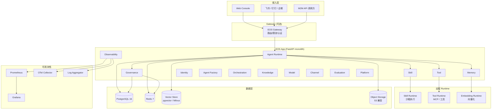
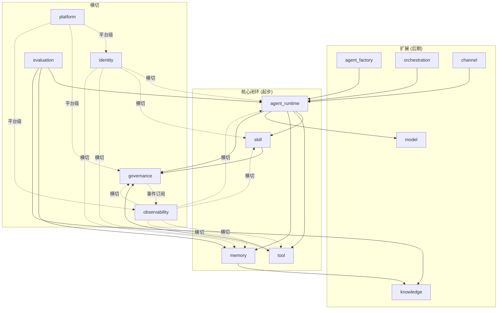
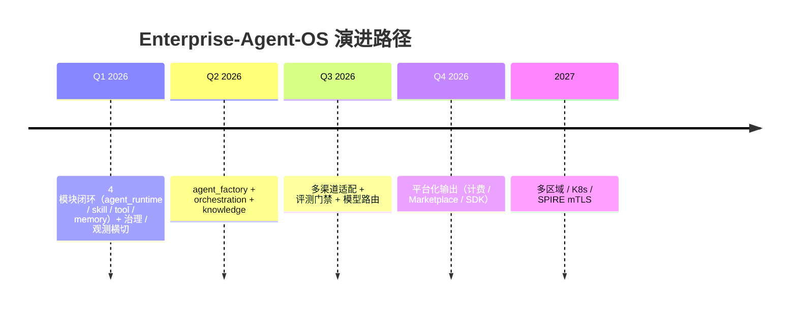

# 01 · 架构总览

> 设计目标、核心概念、部署拓扑、技术选型。Enterprise-Agent-OS 是面向企业的通用 AI Agent / 数字员工基础平台。

> **基于 docs/python-refactor/01-架构总览.md 模板**。
> 与原模板差异：起步范围缩为 4 模块闭环；多租户；Agent Runtime 提升为平台核心。

---

## 1.1 设计目标

| 目标 | 说明 |
|---|---|
| **统一 Agent 运行时** | 所有类型 Agent（对话 / 任务 / 工作流 / 粗粒度）共享 Session / Context / Tool / Memory 抽象 |
| **能力可插拔** | 工具、技能、知识、模型、渠道以"能力包"形式注册；按需启用 / 禁用 |
| **多租户多 Agent** | 平台租户 + 工作区两级；一个租户内可同时运行多种 Agent 类型 |
| **过程可观测** | 任何 Agent turn、tool 调用、skill 执行全程 trace + log + metric |
| **治理前置** | policy / approval / quota / audit 横切所有 Agent 调用；不绕开 |
| **效果可评估** | 内置评测体系与门禁；不达标禁止发布 |
| **企业级可部署** | 单体 FastAPI + 可选 gateway；Docker Compose 起步，K8s 远期 |

---

## 1.2 核心概念

### 1.2.1 多租户层级

```
Platform
└── Tenant (租户，计费/配额/资源隔离单位)
    └── Workspace (工作区，事件总线/治理/知识的逻辑边界)
        └── Agent (Agent 定义)
            └── AgentVersion (不可变版本)
                └── Session (执行上下文)
                    └── Turn (单轮输入 + 完整响应)
                        └── ToolCall / SkillInvocation / MemoryWrite
```

### 1.2.2 Agent 闭环

```
┌─────────────────────────────────────────────────────────────┐
│                        Agent Runtime                         │
│                                                              │
│   User ─▶ Turn ─▶ Plan ─▶ Tool/Skill/Memory ─▶ Response      │
│              │                                                │
│              └── trace_id 贯穿全链路                          │
└─────────────────────────────────────────────────────────────┘
                              │
       ┌──────────────────────┼──────────────────────┐
       ▼                      ▼                      ▼
   Governance            Observability           Billing
   (policy / approval)    (trace / metric / log)  (cost / quota)
```

### 1.2.3 能力类型

| 能力 | 形态 | 调用协议 | 隔离 |
|---|---|---|---|
| **Tool** | 无状态函数 / API 包装 | MCP / OpenAPI / 自定义 JSON-RPC | 网络隔离 |
| **Skill** | 沙箱内可执行包（Python / Node） | RunToken + HTTP | 进程级沙箱 |
| **Memory** | 长期记忆条目 | 嵌入式 SDK / REST | 持久化 + 向量索引 |
| **Knowledge** | 文档 + 向量化 + 检索 | 嵌入式 SDK / REST | 持久化 + 向量索引 |
| **Model** | LLM provider | OpenAI 兼容 / 自定义 | API Key |

---

## 1.3 部署拓扑



---

## 1.4 模块依赖图



依赖规则（import-linter 强约束）：
- `agent_runtime` 可以依赖 `skill` / `tool` / `memory` / `model` / `governance` 的端口
- `skill` / `tool` / `memory` 互相不可直接依赖（仅通过事件总线）
- `governance` 不反向依赖业务模块
- 横切模块 (`identity` / `observability`) 通过端口注入

---

## 1.5 六边形分层（hexagonal）

每个能力模块统一为：

```
modules/<m>/
├── domain/                # 实体 / 值对象 / 领域事件 / 领域错误（纯 Python）
├── application/           # 服务 / 用例 / 端口接口（不可知基础设施）
├── adapter/
│   ├── http/              # FastAPI 路由 / DTO 转换
│   ├── persistence/       # SQLAlchemy ORM / 仓储实现
│   ├── events/            # 事件订阅 / 发布实现
│   └── external/          # 外部系统适配（LLM / MCP / 沙箱）
└── tests/
```

依赖方向：`adapter → application → domain`；`domain` / `application` 不允许 import 任何 `fastapi` / `sqlalchemy` / `redis` / `httpx`。

---

## 1.6 RESTful 严格状态码（与原模板一致 + Agent 平台扩展）

| 状态码 | 场景 | 示例 |
|---|---|---|
| **200 OK** | 同步查询成功 | `GET /v1/agents/{id}` |
| **201 Created** + `Location` | 创建资源 | `POST /v1/sessions` |
| **202 Accepted** | 异步任务 / 待审批 | `POST /v1/sessions/{sid}/turn` (提交) / policy approval 等待 |
| **204 No Content** | 删除 / 关闭 | `DELETE /v1/sessions/{sid}` |
| **207 Multi-Status** | 批量部分成功 | `POST /v1/tools/batch_invoke` |
| **400 Bad Request** | schema 校验失败 | 缺字段、类型错 |
| **401 Unauthorized** | 无 token / token 过期 | |
| **403 Forbidden** | 策略拒绝 / 越权 / 跨租户 | `ACTION_DENIED` / `WORKSPACE_DENIED` |
| **404 Not Found** | 资源不存在 | |
| **409 Conflict** | 唯一约束 / 状态冲突 | Agent 已发布 |
| **410 Gone** | 资源已硬删 | |
| **412 Precondition** | `If-Match` 失败 | |
| **422 Unprocessable** | 语义校验失败 | 评测分数不达标 |
| **429 Too Many Requests** + `Retry-After` | 限流 / 配额耗尽 | |
| **500/502/503/504** | 依赖不可用 | LLM 上游 5xx / PG 故障 |
| **507 Insufficient Storage** | 配额耗尽 | 存储超限 |

详见 [06-接口规范.md](06-接口规范.md)。

---

## 1.7 鉴权体系（多租户）

| 维度 | 设计 |
|---|---|
| 租户头 | `X-Tenant-Id`（必填，多租户硬隔离） |
| 工作区头 | `X-Workspace-Id`（必填，事件总线 / 治理边界） |
| 用户鉴权 | JWT（`Authorization: Bearer ...`） |
| M2M 鉴权 | API Key（`X-Api-Key: ...`） |
| 签名下载 | 5 分钟过期 HMAC URL |
| Mock 拒绝 | `DE_BAN_MOCK_TOKEN=1` 在所有非 demo 环境 |

---

## 1.8 可观测性维度

| 维度 | 工具 | 关键指标 |
|---|---|---|
| **trace** | OpenTelemetry | `agent.turn.duration` `tool.call.duration` `skill.invoke.duration` |
| **metric** | Prometheus | token 用量 / tool 调用次数 / skill 失败率 / session 数 |
| **log** | structlog + JSON | 结构化日志 + trace_id 贯穿 |
| **cost** | 自埋点 | 按租户 / Agent / 模型统计 token 成本 |
| **quality** | Evaluation | 评测分数 / 召回率 / 人工反馈 |

---

## 1.9 技术选型

| 维度 | 选择 | 理由 |
|---|---|---|
| Web 框架 | **FastAPI 0.115+** | async 原生 + OpenAPI 自动生成 |
| 数据校验 | **Pydantic v2** | 类型严格、性能高 |
| ORM | **SQLAlchemy 2.0 async + asyncpg** | 成熟生态、async 一等公民 |
| 迁移 | **Alembic** | 唯一选择 |
| 事件总线 | **InProcessBus（dev）+ RedisStreamBus（prod）** | 单体起步、生产可切 |
| LLM 抽象 | **OpenAI 兼容 + 自定义 provider** | 适配所有主流 LLM |
| 沙箱 | **本地执行（dev）+ E2B / Docker / Firecracker（prod）** | 隔离强度按环境 |
| 向量 | **pgvector（默认）+ Milvus（远期）** | 起步不引入新组件 |
| 缓存 | **Redis 7** | session / rate limit / stream |
| 对象存储 | **S3 兼容**（MinIO 本地 / 阿里云 OSS 生产） | 附件 / skill 产物 / 知识原文 |
| 工作流引擎 | **可选 Temporal** | 多步 / 审批 / 长流程需要时启用 |
| 鉴权 | **JWT + API Key** | 双轨 |
| 监控 | **OpenTelemetry + Prometheus + Grafana** | 业界事实标准 |
| 部署 | **Docker Compose（dev）+ 镜像（staging/prod）** | 起步轻、远期 K8s |
| 包管理 | **uv workspace** | 单 repo 多包；比 poetry 快、比 pdm 标准 |

---

## 1.10 与 python-refactor 模板的关键差异

| 维度 | python-refactor | Enterprise-Agent-OS |
|---|---|---|
| 起步范围 | 8 模块全量渐进 | **4 模块闭环优先**（agent_runtime / skill / tool / memory） |
| 多租户 | 仅 Workspace | **Tenant + Workspace 两级** |
| Agent 抽象 | 隐式（cap 模块内） | **Agent Runtime 提升为平台核心** |
| 编排 | workflow 模块 | **orchestration**（可调度其他 Agent） |
| 模型 | 隐藏在 cap | **独立 model 模块** |
| 知识 | 隐藏在 cap | **独立 knowledge 模块** |
| 渠道 | 隐藏在 cap | **独立 channel 模块** |
| 治理 | policy / audit 分两模块 | **合并为 governance**，审计是其内部订阅者 |
| 鉴权 | JWT | **JWT + API Key 双轨** |
| 接口扩展 | 主要 REST + SSE | **REST + SSE + MCP + OpenAPI 工具协议** |

详见各章节末尾"差异点"标注。

---

## 1.11 性能目标（与原模板一致 + 扩展）

| 指标 | 目标 | 备注 |
|---|---|---|
| 冷启动 | ≤ 30s | development 含 ensure |
| 内存 | ≤ 800 MB / worker | 4 workers × 800 MB |
| P95 单回合 | ≤ 原基线 + 20% | SSE 主路径 |
| HTTP 普通 P95 | ≤ 200ms | |
| SSE 首个 chunk P95 | ≤ 1500ms | |
| Tool 调用 P95 | ≤ 500ms | 同步 |
| Memory 检索 P95 | ≤ 200ms | top-k=10 |
| Skill 执行 P95 | ≤ 30s | 含沙箱启动 |

---

## 1.12 演进路径


