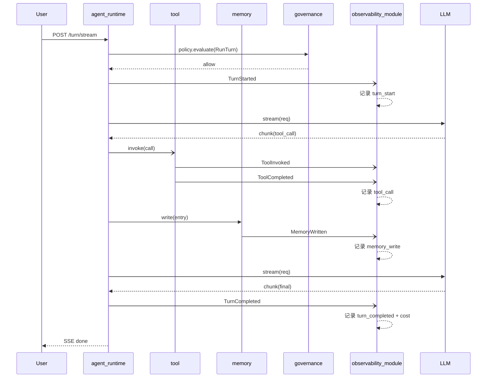

# 05 · 跨模块协作

> 跨模块协作的三种模式：事件总线、端口互调、跨模块 DTO。重点：Agent 闭环事件链。

> **基于 docs/python-refactor/05-跨模块协作.md 模板**。
> 与原模板差异：新增 Agent 闭环事件链；Tool → Skill → Memory 的解耦以事件为主；新增多租户事件隔离。

---

## 5.1 协作原则

| 原则 | 说明 |
|---|---|
| **优先事件** | 跨模块状态变更走 `EventBus`；订阅者异步处理，避免循环依赖 |
| **端口调用** | 同步调用其他模块的能力，通过 `application/ports/` 接口 |
| **横切由组合根注入** | `identity` / `governance` / `observability_module` 通过 DI 注入到所有模块 |
| **多租户隔离** | 所有事件携带 `tenant_id` + `workspace_id`；订阅者按租户过滤 |
| **事件幂等** | 订阅者必须幂等（事件可能重复投递） |

---

## 5.2 协作模式

### 5.2.1 模式 A：事件总线（首选）

**场景**：跨模块状态变化广播；订阅者解耦。

```python
# 发布方（modules/agent_runtime）
await self.events.publish(
    SessionStarted(
        session_id=session.id,
        tenant_id=ctx.tenant_id,
        workspace_id=ctx.workspace_id,
        agent_id=session.agent_id,
        occurred_at=datetime.utcnow(),
    )
)

# 订阅方（modules/governance）
self.bus.subscribe(SessionStarted, self._on_session_started)


async def _on_session_started(self, event: SessionStarted):
    async with self.uow_factory() as uow:
        await self.audit_repo.append(event)
        await uow.commit()
```

**适用**：
- governance 订阅所有业务事件做审计
- observability_module 订阅所有事件做埋点
- memory 写完后通知 agent_runtime 召回

### 5.2.2 模式 B：端口调用（同步）

**场景**：当前用例必须同步拿到另一个模块的能力结果。

```python
# modules/agent_runtime/application/services.py
class AgentRuntimeService:
    def __init__(
        self,
        llm: LLMPort,
        tool: ToolPort,
        skill: SkillPort,
        memory: MemoryPort,
        knowledge: KnowledgePort,
        policy: PolicyPort,
        events: EventBus,
    ): ...

    async def run_turn_stream(self, ctx, session_id, command):
        # 通过端口同步调用
        decision = await self.policy.evaluate(ctx, action)
        async for chunk in self.llm.stream(...):
            ...
```

**注意**：端口是 `Protocol`，不耦合具体实现；由 `composition/eos_app/container.py` 注入。

### 5.2.3 模式 C：跨模块 DTO

**场景**：跨模块传递的数据结构。

所有跨模块 DTO 放 `libs/schema/src/eos_schema/dto.py`，避免各模块互相 import 内部模型。

```python
# libs/schema/src/eos_schema/dto.py
class ToolCallDTO(BaseModel):
    id: ToolCallId
    tool_name: str
    arguments: dict
    result: dict | None = None


class SkillInvocationDTO(BaseModel):
    id: SkillInvocationId
    skill_name: str
    inputs: dict
    result: dict | None = None
```

---

## 5.3 事件目录（完整）

### 5.3.1 Agent Runtime 事件

| 事件 | 触发 | 主要订阅者 |
|---|---|---|
| `SessionStarted` | POST /sessions 创建 | governance / observability_module |
| `SessionClosed` | DELETE /sessions/{sid} | governance / observability_module |
| `TurnStarted` | POST /turn 接收 | observability_module |
| `TurnCompleted` | turn 成功结束 | observability_module / agent_factory（计数） |
| `TurnFailed` | turn 异常 | observability_module |
| `TurnDenied` | policy deny | observability_module |
| `ToolCallRequested` | Agent 决定调 tool | observability_module |
| `ToolCallCompleted` | tool 返回结果 | observability_module |
| `MemoryRecallRequested` | Agent 召回记忆 | observability_module |

### 5.3.2 Tool 事件

| 事件 | 触发 | 主要订阅者 |
|---|---|---|
| `ToolRegistered` | POST /tools | observability_module |
| `ToolUpdated` | PATCH /tools/{tid} | observability_module |
| `ToolInvoked` | 调 tool 入参 | governance（policy） / observability_module |
| `ToolCompleted` | tool 成功返回 | observability_module |
| `ToolFailed` | tool 抛错 | observability_module |

### 5.3.3 Skill 事件

| 事件 | 触发 | 主要订阅者 |
|---|---|---|
| `SkillInstalled` | POST /skills/{id}/install | observability_module |
| `SkillInvoked` | 调 skill 入参 | governance / observability_module |
| `SkillCompleted` | skill 返回 | observability_module |
| `SkillFailed` | skill 异常 | observability_module |
| `SkillTimeout` | 沙箱超时 | observability_module |

### 5.3.4 Memory 事件

| 事件 | 触发 | 主要订阅者 |
|---|---|---|
| `MemoryWritten` | POST /memory/entries | governance / observability_module / **agent_runtime**（下次 turn 召回） |
| `MemoryRevoked` | 软删 | observability_module |
| `MemoryExpired` | 过期清理 | observability_module |

### 5.3.5 Governance 事件

| 事件 | 触发 | 主要订阅者 |
|---|---|---|
| `ApprovalRequested` | policy 返回 approval | observability_module |
| `ApprovalGranted` | 用户 approve | observability_module |
| `ApprovalDenied` | 用户 deny | observability_module |
| `ApprovalExpired` | TTL 过期 | observability_module |
| `PolicyDecisionMade` | 任何 policy 评估 | observability_module |

### 5.3.6 Identity 事件

| 事件 | 触发 | 主要订阅者 |
|---|---|---|
| `TenantCreated` | POST /tenants | observability_module |
| `WorkspaceCreated` | POST /workspaces | observability_module |
| `UserAdded` | POST /users | observability_module |
| `APIKeyIssued` | POST /api-keys | observability_module |
| `APIKeyRevoked` | DELETE /api-keys | observability_module |

---

## 5.4 Agent 闭环事件链（核心场景）

### 5.4.1 场景：用户发起 turn，Agent 调用 tool，写 memory

```
┌──────────────────────────────────────────────────────────────────┐
│ Step 1: 创建 Session                                              │
│   agent_runtime.POST /v1/agents/{aid}/sessions                     │
│   → publish(SessionStarted)                                      │
│   → governance 订阅 → 写 audit_log                                │
│   → observability_module 订阅 → 记录 session_created              │
└──────────────────────────────────────────────────────────────────┘
                              ↓
┌──────────────────────────────────────────────────────────────────┐
│ Step 2: 发起 Turn（流式）                                         │
│   agent_runtime.POST /v1/sessions/{sid}/turn/stream               │
│   → policy.evaluate(ctx, RunTurn) → allow                         │
│   → publish(TurnStarted)                                         │
│   → observability_module 订阅 → 记录 turn_start                   │
└──────────────────────────────────────────────────────────────────┘
                              ↓
┌──────────────────────────────────────────────────────────────────┐
│ Step 3: LLM 推理 → 决定调 tool                                    │
│   agent_runtime → LLMPort.stream() → chunk 含 tool_call           │
│   → publish(ToolCallRequested)                                   │
│   → SSE 推送给客户端                                              │
└──────────────────────────────────────────────────────────────────┘
                              ↓
┌──────────────────────────────────────────────────────────────────┐
│ Step 4: 调用 Tool                                                 │
│   agent_runtime → ToolPort.invoke(call) → result                  │
│   → policy.evaluate(ctx, InvokeTool) → allow                      │
│   → publish(ToolInvoked)                                         │
│   → tool 模块自身 publish(ToolCompleted)                          │
│   → governance 订阅 ToolInvoked → quota 计数                      │
│   → observability_module 订阅 → 记录 tool_call                    │
└──────────────────────────────────────────────────────────────────┘
                              ↓
┌──────────────────────────────────────────────────────────────────┐
│ Step 5: 写 Memory（Agent 决定）                                   │
│   agent_runtime → MemoryPort.write(entry)                         │
│   → publish(MemoryWritten)                                       │
│   → observability_module 订阅 → 记录 memory_write                 │
│   → governance 订阅 → quota 计数                                  │
└──────────────────────────────────────────────────────────────────┘
                              ↓
┌──────────────────────────────────────────────────────────────────┐
│ Step 6: LLM 继续推理 → 完成                                        │
│   agent_runtime → LLMPort.stream() → final chunk                  │
│   → publish(TurnCompleted)                                       │
│   → observability_module 订阅 → 记录 turn_completed + cost        │
│   → agent_factory 订阅 → 累计该 AgentVersion 的调用次数            │
└──────────────────────────────────────────────────────────────────┘
```

### 5.4.2 事件链汇总（时序）



### 5.4.3 拒绝路径

```
agent_runtime → policy.evaluate(ctx, RunTurn)
policy → deny (e.g. ACTION_DENIED)
agent_runtime → publish(TurnDenied)
   ↓
governance 订阅 → 写 audit
observability_module 订阅 → 记录 turn_denied

agent_runtime → SSE 推送 error event
   ↓
客户端收到 403 + ACTION_DENIED
```

### 5.4.4 审批路径

```
agent_runtime → policy.evaluate(ctx, InvokeTool)
policy → approval
agent_runtime → publish(ApprovalRequested)
governance 订阅 → 创建 Approval 记录
agent_runtime → SSE 推送 wait_approval event
   ↓
用户：POST /v1/governance/approvals/{id}/approve
governance → publish(ApprovalGranted)
agent_runtime 订阅 → 重试 InvokeTool
```

---

## 5.5 Tool → Skill → Memory 互调

**约束**：tool / skill / memory 互相不可直接依赖（架构层强约束），仅通过事件总线传递信息。

### 5.5.1 tool 调用 skill（不推荐）

工具内部如需执行 skill，**禁止**直接 import `modules/skill`；通过：
1. tool 返回结构化字段（如 `{"action": "run_skill", "skill_id": "...", "inputs": {...}}`）
2. Agent 解析该结果，决定是否调用 skill

> 这是"工具只负责 IO，编排由 Agent 决策"的边界。

### 5.5.2 skill 写 memory

skill 内部如需写入 memory，**禁止**直接调用 memory 模块；通过：
1. skill 返回 `{"memory_candidates": [{"content": "...", "scope": "user"}]}`
2. Agent 决定是否写 memory

> skill 是"纯函数"，副作用由 Agent 协调。

### 5.5.3 memory 召回

agent_runtime 在每次 turn 开头**主动**调用 `MemoryPort.search(query)`，而非订阅 `MemoryWritten`：
- 订阅事件意味着异步，不能保证 recall 时数据已落库
- 主动 recall 更可控，且能在 recall 时设置租户 / workspace 维度

---

## 5.6 多租户事件隔离

### 5.6.1 事件基类

```python
# libs/messaging/src/eos_msg/event.py
from pydantic import BaseModel
from libs.schema import TenantId, WorkspaceId


class DomainEvent(BaseModel):
    tenant_id: TenantId
    workspace_id: WorkspaceId
    occurred_at: datetime
```

### 5.6.2 订阅者按租户过滤

```python
# governance 订阅器：只关心本租户
class GovernanceSubscriber:
    async def on_session_started(self, event: SessionStarted):
        # event.tenant_id 已经是当前请求上下文
        # 多副本时 RedisStreamBus 已经按 tenant_key 分片
        ...
```

### 5.6.3 Redis Stream 分片（多副本）

```python
# 写入时按 tenant 路由到不同 stream
async def publish(self, event):
    stream_key = f"eos:events:{event.tenant_id}"
    await self._redis.xadd(stream_key, {"data": event.model_dump_json()})
```

> 单租户内多副本共享一个 stream；不同租户彻底隔离。

---

## 5.7 端口与适配器注入

### 5.7.1 端口定义（在 application 层）

```python
# modules/agent_runtime/src/deos/modules/agent_runtime/application/ports.py
from typing import Protocol


class ToolPort(Protocol):
    async def invoke(self, call: ToolCall) -> ToolResult: ...
```

### 5.7.2 适配器实现（在 adapter 层）

```python
# modules/agent_runtime/src/deos/modules/agent_runtime/adapter/external/tool_client.py
from modules.tool.application.services import ToolService


class HttpToolAdapter:
    """agent_runtime 通过 HTTP 调 tool 模块"""

    def __init__(self, base_url: str):
        self._client = httpx.AsyncClient(base_url=base_url)

    async def invoke(self, call: ToolCall) -> ToolResult:
        r = await self._client.post(f"/v1/tools/{call.tool_name}/invoke", json=call.arguments)
        r.raise_for_status()
        return ToolResult(**r.json()["data"])
```

> 起步阶段单体部署，可以直接调用 tool 模块的 service（in-process），不绕 HTTP；
> 多服务部署时切到 `HttpToolAdapter`。
> 这是组合根的决策，业务代码不变。

### 5.7.3 组合根装配

```python
# composition/eos_app/container.py
def build_container() -> Container:
    c = Container()

    # 单体内：直接注入 service
    c.register(ToolPort, lambda: InProcessToolAdapter(c.resolve(ToolService)))

    # 多服务：HTTP 客户端
    # c.register(ToolPort, lambda: HttpToolAdapter(base_url=settings.tool_service_url))

    return c
```

---

## 5.8 事务与发布顺序

### 5.8.1 反模式

```python
# 错误：事务内发布事件
async def create_session(self, ctx, command):
    async with self.uow_factory() as uow:
        await self.sessions.add(session)
        await self.events.publish(SessionStarted(...))  # ❌
        await uow.commit()
```

### 5.8.2 正例

```python
# 正确：先提交事务，再发布事件
async def create_session(self, ctx, command):
    session = Session.create(...)
    async with self.uow_factory() as uow:
        await self.sessions.add(session)
        await uow.commit()
    # 事务外发布
    await self.events.publish(SessionStarted(
        session_id=session.id,
        tenant_id=ctx.tenant_id,
        workspace_id=ctx.workspace_id,
        ...
    ))
```

### 5.8.3 Outbox Pattern（远期）

事务内写 `outbox` 表，后台 worker 投递；本期不实现，预留扩展点。

---

## 5.9 跨模块接口约定

| 项 | 约定 |
|---|---|
| 跨模块调用方向 | 端口向下；不允许跨模块 service 直调 |
| DTO 位置 | `libs/schema/src/eos_schema/dto.py` |
| 端口位置 | `modules/<m>/application/ports/` |
| 适配器位置 | `modules/<m>/adapter/external/` |
| 事件订阅 | `modules/<m>/adapter/events/subscribers.py` |
| 事件发布 | `modules/<m>/adapter/events/publishers.py` |

---

## 5.10 反模式

| 反例 | 修正 |
|---|---|
| `from modules.tool.application.services import ToolService` 在 agent_runtime | 通过 `ToolPort` 协议 + DI |
| `events.publish` 在事务内 | 移到事务外 |
| 跨模块传递 ORM 模型 | 用 `libs/schema` DTO 转换 |
| skill 直接写 memory | 通过 Agent 协调 |
| tool 直接调 skill | 通过 Agent 协调 |
| 订阅事件后立即读库（事件可能未落库） | 等待事务提交后再发；订阅者读自己的 projection |
| 多租户事件不隔离 | 所有事件带 tenant_id；stream 分片 |
