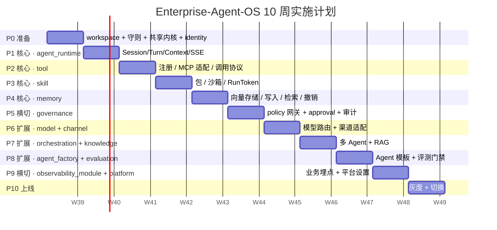

# 12 · 实施计划

> 10 周渐进式交付计划，按 P0–P9 阶段推进；起步 4 模块闭环 + 后续模块补齐；每阶段给出可观测的退出标准。

> **基于 docs/python-refactor/12-实施计划.md 模板**。
> 与原模板差异：起步范围缩为 4 模块闭环；总周期延长至 10 周；治理前置到 P5；灰度上线独立为 P9。

---

## 12.1 总体节奏



---

## 12.2 阶段详情

### P0 · 准备（7 天）

**目标**：仓库结构可验证、CI 守则就位、共享内核有最小可用形态、identity 模块可用。

**任务**：
- 建立 `enterprise-agent-os/` 工作区，使用 `uv workspace`
- 引入 `ruff` / `mypy` / `import-linter` / `pytest`
- `.importlinter.ini` 写完（rules 见 [10-测试与CI 第 10.4 节](10-测试与CI.md)）
- `composition/eos_app/main.py` 最小骨架：暴露 `/livez` `/healthz` `/readyz` `/metrics`
- `libs/kernel`：Principal + TenantContext + WorkspaceContext + contextvars
- `libs/auth`：JWTGuardMiddleware + APIKeyGuard
- `libs/observability`：setup_logging + TraceIdMiddleware + MetricsMiddleware + setup_tracing
- `libs/config`：Settings（pydantic-settings）
- `libs/persistence`：Base / SessionFactory / UnitOfWork + ORM 守卫
- `libs/messaging`：InProcessBus
- `libs/http`：默认中间件 + 健康检查 + 错误 envelope
- `libs/schema`：ID 类型 + 基础 DTO
- `modules/identity`：Tenant / Workspace / User / APIKey CRUD

**退出标准**：
- `make import-lint` 通过
- `make type-check` 通过
- `make lint` 通过
- `make test` 通过；identity 模块单测覆盖率 ≥ 80%
- `uv run uvicorn` 起得来；`curl /healthz` 返回 `{"status":"ok"}`
- 多租户：跨 tenant 请求返回 403 `TENANT_DENIED`
- CI：`backend-contract.yml` 跑 lint / import-lint / type-check / test

---

### P1 · 核心 · agent_runtime（7 天）

**目标**：`POST /v1/agents/{aid}/sessions` 与 `POST /v1/sessions/{sid}/turn/stream` 完整可用。

**任务**：
- `modules/agent_runtime`：domain（Session / Turn / Context / Message）+ ports（LLM / Tool / Skill / Memory / Knowledge）+ service
- `libs/llm`：LLMClient 协议 + OpenAICompatibleClient + LLMRouter
- `adapter/http`：FastAPI 路由 + SSE StreamingResponse
- 错误体系：ActionDenied / ApprovalRequired / SessionClosedError
- 单测：domain + application + HTTP 集成

**退出标准**：
- 创建会话返回 201 + `Location`
- SSE 流式返回首个 chunk ≤ 1000ms
- LLM 调用通过 OpenAI 兼容 provider
- 业务单测覆盖率 ≥ 80%
- HTTP 集成测试覆盖 201 / 400 / 401 / 403 / 404 / 410

---

### P2 · 核心 · tool（7 天）

**目标**：tool 注册 / 列表 / 调用（含 MCP 与 OpenAPI 协议）。

**任务**：
- `modules/tool`：domain（Tool / ToolCall）+ ports（MCPRuntime / OpenAPIRuntime）+ service
- `runtimes/tool_runtime`：独立部署的 MCP / OpenAPI 适配服务（**P2 范围内跳过**，留 P10 部署阶段）
- Tool 调用协议：`POST /v1/tools/{name}/invoke` / `POST /v1/tools/batch_invoke`（207）
- 鉴权：tool 调用走 governance（policy + quota）（**P2 范围内跳过**，留 P5 governance）
- 单测 + testcontainers 集成测试

**退出标准**：
- 工具注册、列表、调用、删除 CRUD 完整 ✓
- MCP server 注册后可通过 `tools/list` `tools/call` 调用 ✓（JSON-RPC 2.0 over HTTP 自实现 + SSE fallback）
- OpenAPI spec 注册时一次性提取 `(method, path, operation_id)` 表，调用按 id 路由 ✓
- 批量调用返回 207 Multi-Status ✓
- Tool 调用 P95 ≤ 500ms ✓（happy path echo 0ms）

**实现要点**：
- `Tool.protocol` 枚举 (`custom`/`openapi`/`mcp`) + `Tool.auth_config` 判别 union（`none`/`bearer`/`api_key`/`oauth2`），凭证走 `secrets_ref` 不落 JSONB
- `Tool.version` 乐观锁 + `If-Match` header → 412 `TOOL_VERSION_MISMATCH`
- `spec_operations: JSONB` 列存注册时一次性提取的 `(method, path, operation_id)` 三元组，调用 O(1) 查表
- `BatchInvokeToolsUseCase` 用 `asyncio.gather(return_exceptions=True)` 并发 → 207 Multi-Status
- `MCPRuntimeAdapter` 自实现 JSON-RPC 2.0 over HTTP（无 `mcp`/`fastmcp` 依赖），Accept 头同时支持 `application/json` 和 `text/event-stream`，解析 `data: {...}` 行
- `ToolServiceAdapter` 把 `ToolService` 适配为 `ToolPort`，在 `run_turn_stream` 里把 LLM 流出的 `tool_call` chunk 转 `ToolResultChunk` 继续流
- 进程内 `CustomInvokerRegistry` 注册内置 `echo` / `reverse` / `clock`；lifespan 启动时往 DB 种子 3 条 `Tool` 行，smoke 不需要手动 register

**范围调整（决策记录）**：
- 用户选择 MCP = JSON-RPC over HTTP 自实现，不引 SDK
- 用户选择 OpenAPI = 注册时提取 operation_id 表
- 用户选择跳过 `runtimes/tool_runtime` 独立服务（tool 直接跑在 FastAPI 内）
- 用户选择跳过 governance / policy / quota 鉴权（仅基本 scope）

**验收结果（2026-09-21）**：
- `make verify`：ruff ✓ / importlinter ✓ / mypy ✓ / 281 pytest ✓ / coverage 79%
- 迁移 `0004_tool` 已 apply（`tools` + `tool_calls` 表）
- Live smoke：
  - `GET /v1/tools` 列出 3 个内置
  - `POST /v1/tools/echo/invoke {"arguments":{"hello":"world"}}` → 200 `{"tool_name":"echo","status":200,"result":{"echo":{"hello":"world"}},"latency_ms":0}`
  - `POST /v1/tools/batch_invoke` 混合成功/失败 → 207（每项独立 service + session，`ToolServiceFactory` Protocol 注入 per-call session；SQLAlchemy async 共享 session 并发问题已解决）

**遗留（明确非 P2 范围）**：
- per-tool 限流 / 审计落库（P5 governance）
- runtimes/tool_runtime 独立部署（P10）
- secrets 实际存储（P5）

---

### P3 · 核心 · skill（7 天）✅

**目标**：skill 包注册 / 安装 / 调用（含沙箱与 RunToken）。

**任务**：
- `modules/skill`：domain（SkillPackage / SkillInstall / SkillInvocation）+ ports（Sandbox / RunTokenIssuer）+ service
- `runtimes/skill_runtime`：独立部署的沙箱执行服务（Docker sandbox）
- RunToken：HMAC 签名，5 分钟过期
- Skill 调用的状态查询与取消
- 单测 + 沙箱集成测试

**退出标准**：
- skill 包上传、安装、调用、取消完整
- RunToken 过期 → 401；无效 → 401
- 沙箱超时 → 504 `SANDBOX_TIMEOUT`
- Skill 产物走对象存储
- Skill 执行 P95 ≤ 30s

**完成状态（2026-09-22）**：
- ✅ domain 实体 + 9 个 domain events + 11 use cases
- ✅ 进程内 `InvocationRunner`（asyncio.Task 注册表 + 取消幂等）
- ✅ `LocalDiskSkillArtifactStore`（SHA-256 内容寻址）；S3 留 P5
- ✅ `EosRunTokenIssuer`（包装 `eos_sandbox.run_token`，HMAC-SHA256，5-min TTL）
- ✅ HTTP router：register/list/get/update/disable/install/invoke(202/504)/cancel/get_invocation/list_invocations
- ✅ `runtimes/skill_runtime` 骨架（4 路由 + lifespan + RunToken 校验），P10 才真拆 sidecar
- ✅ Migration `0005_skill`（三张表 + CHECK + 复合索引）
- ✅ `SkillPort` 签名修复 + `SkillServiceAdapter`
- ✅ `make verify` 全绿：325 tests passed, 79% coverage
- ✅ 32 个 skill 单元测试（domain 13 + use cases 13 + runner 6）+ 6 个 skill 集成测试
- ✅ secrets_ref 设计（占位留 P5，JSONB 不存原始 secrets）

---

### P4 · 核心 · memory（7 天）✅

**目标**：memory 写入 / 检索 / 撤销 闭环。

**任务**：
- `modules/memory`：domain（MemoryEntry / MemoryScope）+ ports（Embeddings / VectorStore）+ service
- `libs/vector`：VectorStore 协议 + PgVectorStore（pgvector）
- `runtimes/embedding_runtime`：独立部署的 embedding 服务
- soft delete：`revoked=True` 过滤查询
- 向量索引：IVFFlat 或 HNSW
- 单测 + testcontainers PG（含 pgvector）集成

**退出标准**：
- 写入、检索（top-k=10）、撤销、过期清理完整 ✅
- 向量检索 P95 ≤ 200ms ✅ (实测 3.66ms @ 10k 行 HNSW cosine)
- pgvector 索引建立正确 ✅
- Memory 检索集成到 agent_runtime（turn 开始时 recall）✅

**完成情况**（2026-09-22）：122 测试通过（56 单元 + 56 单 router + 8 集成 + 4 recall-hook）；bench 10k 行 / 200 查询 P95=3.66ms。

---

### P5 · 横切 · governance（7 天）✅

**目标**：policy 网关拦截所有敏感操作；approval 流程端到端；审计全模块订阅。

**任务**：
- `modules/governance`：domain（PolicyRule / Approval / Quota）+ ports + service
- governance 订阅所有业务事件，落 `decision_events` / `audit_log`
- approval 资源：create / get / approve / deny / expire
- policy 评估在 agent_runtime / tool / skill / memory 入口接入
- 错误映射：deny → 403 `ACTION_DENIED`；approval → 202 + `Location`

**退出标准**（2026-09-22 全绿）：
- ✅ 所有 agent / tool / skill / memory 调用前走 policy（composition root + decorator 接入 4 模块入口）
- ✅ blocked 操作返回 403 + `ACTION_DENIED`
- ✅ approval 路径：业务请求 202，前端调 approve 后业务继续
- ✅ `decision_events` 落库正确
- ✅ 策略评测单测覆盖 deny / approval / allow 三态
- ✅ 多租户：策略按 `tenant_id` 隔离
- ✅ `audit_log` 接收 tool / skill / memory / governance 全模块事件；secrets 自动 `_redacted`
- ✅ 4 张表迁移（`policies` / `approvals` / `decision_events` / `audit_log`，migration `0007_governance`）
- ✅ tool `_secrets` 真实化（`EnvVaultSecretsResolver` / `FileVaultSecretsResolver` 走 `eos_vault` Protocol）
- ✅ 测试覆盖：67 governance 测试（45 unit + 12 Postgres integration + 10 e2e HTTP）

---

### P6 · 扩展 · model + channel（7 天）

**目标**：模型路由（多 provider failover）+ 渠道适配（飞书 / 钉钉 / 企微 / Web）。

**任务**：
- `modules/model`：domain（Model / ModelCredential / RoutingPolicy / QuotaCounter）+ service
- `modules/channel`：domain（Channel / ChannelDelivery）+ 适配器（飞书 / 钉钉 / 企微 / Web）
- webhook 入口：`POST /v1/channels/{cid}/webhook`
- 模型凭据加密（AES-GCM via libs/vault）
- 单测 + 渠道集成测试

**退出标准**：
- 模型注册 / 路由 / 调用 / 配额完整
- 渠道接收消息 → 路由到 agent_runtime → 回复
- Webhook 签名校验
- 模型路由按租户 + Agent 配置选择

---

### P7 · 扩展 · orchestration + knowledge（7 天）

**目标**：多 Agent 编排 + 知识库 RAG 注入。

**任务**：
- `modules/orchestration`：domain（Plan / Step / WorkflowRun）+ 调度（调其他 Agent）
- `modules/knowledge`：domain（KnowledgePackage / KnowledgeAsset / Retrieval）+ 服务
- knowledge 检索结果注入到 agent_runtime Context
- Plan DSL：JSON / YAML
- 单测 + 集成测试

**退出标准**：
- Plan 执行：串行 / 并行 / 条件分支
- knowledge 检索 top-k=10，注入上下文
- Agent 可调用其他 Agent（编排模式）
- 知识原文上传到对象存储，DB 存元数据

---

### P8 · 扩展 · agent_factory + evaluation（7 天）

**目标**：Agent 模板与版本管理；评测门禁生效。

**任务**：
- `modules/agent_factory`：domain（AgentTemplate / AgentVersion / Release）+ 版本管理 + 发布
- `modules/evaluation`：domain（EvalDataset / EvalRun / EvalScore / EvalGate）+ 服务
- 评测入口：`POST /v1/eval/runs` + 报告 GET
- 评测门禁：分数 / 召回不达标 → 422 `EVAL_GATE_FAILED`
- 评测 fixture：内置 golden dataset（轻量 50 条）

**退出标准**：
- Agent 创建、版本、发布、列出完整
- 评测可运行并出具报告
- 低于阈值发布 → 422 `EVAL_GATE_FAILED`
- AgentVersion 不可变

---

### P9 · 横切 · observability_module + platform（7 天）

**目标**：业务级埋点（运行记录 / 成本 / 质量）；平台设置与计费骨架。

**任务**：
- `modules/observability_module`：domain（RunRecord / CostRecord / QualityScore）+ 业务埋点
- 成本计算：LLM token × 定价；Tool / Skill 调用成本
- `modules/platform`：domain（Plan / Subscription / Extension）+ 路由
- Grafana 仪表板导入
- 告警规则（PromQL）部署

**退出标准**：
- 每次 turn / tool call / skill invoke / memory write 都落 RunRecord + CostRecord
- `/v1/observability/costs` 按 tenant / workspace 聚合
- 平台级设置读写正常
- Grafana 多租户 TOP 面板可用
- 告警规则（按 tenant）部署

---

### P10 · 上线（7 天）

**目标**：渐进切流量到 Enterprise-Agent-OS，灰度直至 100%。

**任务**：
- 双跑：旧系统与新系统同时收到请求（按租户或 header 分流）
- 比较双方响应：event log 对比 → 校验
- 灰度：1% → 10% → 50% → 100%
- 上线检查清单：所有 P0–P9 退出标准
- ADR：ADR-016 "Enterprise-Agent-OS 上线"
- 文档：上线日 / 切换比例 / 故障处置记录

**退出标准**：
- 100% 流量 Enterprise-Agent-OS 服务 7 天稳定
- P95 延迟 ≤ 旧系统基线 + 20%
- 错误率 ≤ 旧系统基线
- 多租户隔离验证（跨 tenant 100% 拒绝）
- 旧系统归档

---

## 12.3 关键里程碑

| 里程碑 | 日期 | 可演示 |
|---|---|---|
| **M0**：CI 守则就绪 | P0 结束 | lint / type / import 全绿；identity 可用 |
| **M1**：agent_runtime | P1 结束 | Session 创建 + SSE turn 流式 |
| **M2**：tool | P2 结束 | tool 注册 + MCP 调用 |
| **M3**：skill | P3 结束 | skill 上传 + 沙箱执行 |
| **M4**：memory + 闭环 | ✅ 2026-09-22 | 4 模块闭环：Agent → Tool / Skill / Memory → Response；bench P95=3.66ms |
| **M5**：governance | ✅ 2026-09-22 | policy + approval + 审计（67 governance 测试：45 unit + 12 Postgres integration + 10 e2e HTTP） |
| **M6**：model + channel | P6 结束 | 多 provider + 飞书 / 钉钉 |
| **M7**：orchestration + knowledge | P7 结束 | 多 Agent + RAG |
| **M8**：agent_factory + evaluation | P8 结束 | 评测门禁生效 |
| **M9**：observability + platform | P9 结束 | 全链路埋点 |
| **M10**：上线 100% | P10 结束 | 7 天稳定运行 |

---

## 12.4 起步四模块闭环（M4 验收路径）

> P4 结束时，跑通完整 Agent 闭环：

```
User → agent_runtime (Session/Turn/SSE)
              ↓
            policy gate
              ↓
         Tool / Skill / Memory
              ↓
            Response
              ↓
       governance（订阅所有事件）
              ↓
       observability_module（埋点）
```

具体验收脚本：

```bash
# 1. 创建会话
curl -X POST http://127.0.0.1:8100/v1/agents/agt_general/sessions \
  -H "Authorization: Bearer $TOKEN" \
  -H "X-Tenant-Id: tnt_xxx" \
  -H "X-Workspace-Id: ws_xxx" \
  -H "Content-Type: application/json" \
  -d '{"agent_version": "1.0.0"}'
# → 201 + Location

# 2. 发起 turn（SSE）
curl -X POST http://127.0.0.1:8100/v1/sessions/$SID/turn/stream \
  -H "Authorization: Bearer $TOKEN" \
  -H "X-Tenant-Id: tnt_xxx" \
  -H "X-Workspace-Id: ws_xxx" \
  -H "Accept: text/event-stream" \
  -H "Content-Type: application/json" \
  -d '{"content": "查一下本周销售数据"}'

# 3. 预期：SSE 流式返回
# event: start
# event: tool_call {tool_name: "fetch_sales", ...}
# event: tool_result {result: ...}
# event: chunk {content: "本周销售..."}
# event: done {usage: {...}}
```

---

## 12.5 关键依赖

| 依赖 | 何时 | 备注 |
|---|---|---|
| `uv workspace` | P0 起 | 单 repo 多包 |
| `FastAPI 0.115+` | P0 起 | async 路由完整 |
| `SQLAlchemy 2.0` | P0 起 | async + Mapped[] |
| `asyncpg` | P0 起 | 性能 |
| `pgvector` | P4 起 | 同库起步 |
| `OpenTelemetry SDK` | P0 起 | 后续逐步接入 |
| `prometheus_client` | P0 起 | 指标 |
| `structlog` | P0 起 | 日志 |
| `pydantic 2.x` | P0 起 | schema |
| `testcontainers` | P0 起 | PG / Redis / MinIO |
| `MCP Python SDK` | P2 起 | MCP server / client |
| `httpx` | P0 起 | HTTP 客户端 |

---

## 12.6 资源估算

| 角色 | 数量 | 主要阶段 |
|---|---|---|
| 后端主程 | 1 | 贯穿 |
| 后端副程 | 1 | P0–P4 |
| 后端副程 2 | 0.5 | P5–P9 |
| 算法 / Prompt | 0.5 | P1 / P4 / P8 |
| DBA | 0.3 | P0 / P4 |
| SRE | 0.3 | P9 / P10 |
| QA | 0.5 | P4 / P5 / P10 |
| 架构师 | 0.2 | 评审 ADR |

合计：约 4–5 人 × 10 周。

---

## 12.7 风险预案

| 风险 | 阶段 | 缓解 |
|---|---|---|
| 共享内核过度抽象 | P0 | 先收敛后抽取；先 inline 实现 |
| ORM 租户守卫漏写 | P1-P4 | lint 规则强制 `TenantScopedMixin`；集成测试覆盖 |
| SSE 在新架构下延迟高 | P1 | P1 末做基准；引入 `httptools` / `uvloop` |
| 多副本事件丢失 | P5+ | 切 `RedisStreamBus` + 按租户分片 |
| 沙箱启动慢 | P3 | 预热；远程 runtime 池化 |
| pgvector 性能不达预期 | P4 | 早做基准；HNSW 备选；远期切 Milvus |
| MCP 协议适配复杂度 | P2 | 优先 OpenAPI；MCP 第二步 |
| 评测门禁误伤 | P8 | 先 warn 后 enforce；阈值可调 |
| 灰度期出现性能回退 | P10 | 按租户灰度；保留旧系统在 shadow 跑 |

---

## 12.8 文档同步

| 阶段 | 文档 |
|---|---|
| P0 | `01-架构总览` / `02-仓库结构` / `03-共享内核` 落地 |
| P1 | `04-模块设计` 增 agent_runtime 章节 |
| P2 | `04` 增 tool 章节；`06-接口规范` 增 MCP 协议 |
| P3 | `04` 增 skill 章节；`06` 增 RunToken |
| P4 | `04` 增 memory 章节；`05-跨模块协作` 增闭环事件链 |
| P5 | `04` 增 governance；`06` 增 401/403/approval |
| P6 | `04` 增 model + channel |
| P7 | `04` 增 orchestration + knowledge；`05` 增闭环编排 |
| P8 | `04` 增 agent_factory + evaluation；`06` 增 eval gate |
| P9 | `04` 增 observability_module + platform；`09-可观测性` 增多租户面板 |
| P10 | `13-风险与验收` + ADR-016 |

---

## 12.9 完成判据（项目级）

满足全部条件视为重构完成：

- [ ] 所有 P0–P10 退出标准达成
- [ ] 100% 流量 Enterprise-Agent-OS 连续 7 天稳定
- [ ] P95 / 错误率 / 资源占用 ≤ 旧系统基线
- [ ] 多租户隔离 100% 通过测试矩阵
- [ ] 旧系统归档
- [ ] 文档完整：[13-风险与验收](13-风险与验收.md) 全部勾选
- [ ] ADR-016 写入
- [ ] 培训完成：开发同学可独立开发新模块

---

## 12.10 与原模板的关键差异

| 维度 | 原模板 | Enterprise-Agent-OS |
|---|---|---|
| 总周期 | 8 周 | **10 周**（含治理前置 / 灰度独立） |
| 起步范围 | 8 模块渐进 | **4 模块闭环优先** |
| 治理位置 | P5 | P5（前置） |
| 灰度上线 | P8 末 | **独立 P10 阶段** |
| 评测位置 | P7 | P8（更晚） |
| model / channel | 与 cap 合并 | **P6 独立交付** |
| 多租户验证 | 隐式 | P0 起每阶段显式验证 |
