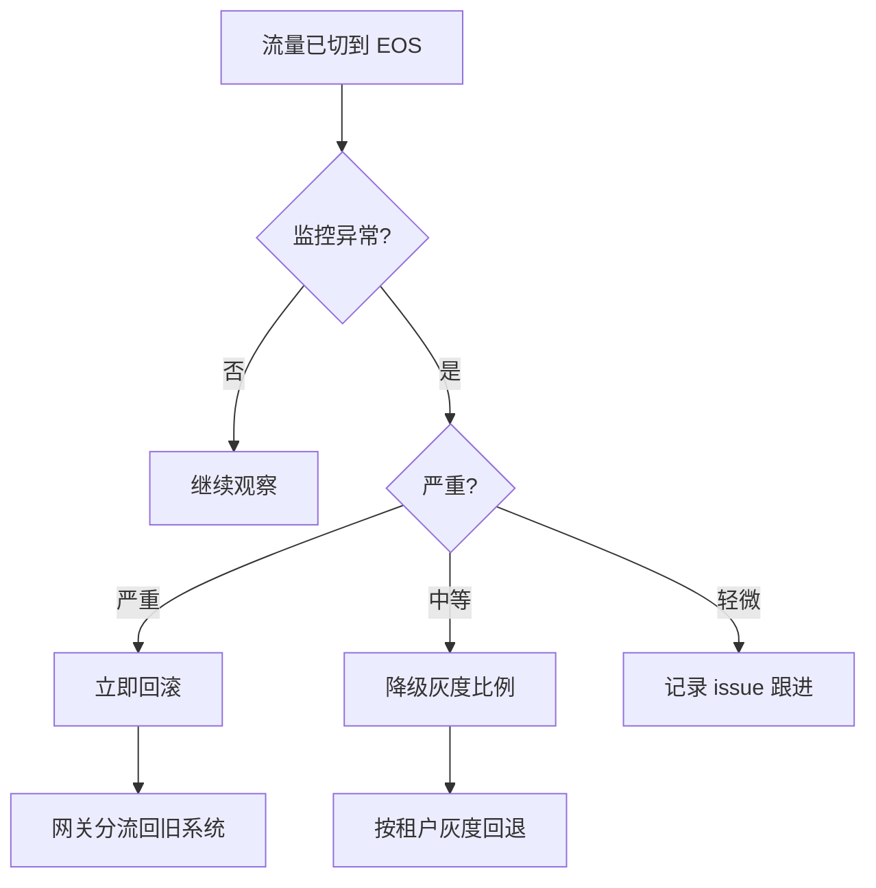

# 13 · 风险与验收

> 风险登记、缓解策略、验收清单。Enterprise-Agent-OS 上线必须全部勾选。

> **基于 docs/python-refactor/13-风险与验收.md 模板**。
> 与原模板差异：新增多租户风险（跨租户数据泄漏）；新增 LLM / Sandbox / MCP 上游风险；新增 Agent 平台特有的合规与计费风险。

---

## 13.1 风险登记

### 13.1.1 架构与技术风险

| 编号 | 风险 | 等级 | 影响 | 缓解 / 应对 |
|---|---|---|---|---|
| R-A01 | 异步并发行为差异（事件顺序、回压、取消） | 高 | 数据不一致 / 死锁 | P0 起跑乱序 / 超时 / 取消回归；Redis Stream DLQ；Outbox 模式预留 |
| R-A02 | SQLAlchemy 异步驱动在 P95 长尾上劣化 | 中 | 性能不达标 | P0 起持续压测；保留 psycopg3 sync fallback 路径 |
| R-A03 | SSE 延迟高于预期 | 高 | 体验回退 | P1 设 perf 基准；uvloop + httptools；模型 router 优化首 token |
| R-A04 | LLM 上游不可用 / 限流 | 高 | 业务中断 | LLMRouter failover；限流时 queue + retry；prompt 缓存 |
| R-A05 | 沙箱启动慢 / 资源耗尽 | 中 | Skill 调用超时 | P3 远程 runtime 池化；预热；超时细分 |
| R-A06 | pgvector 大规模性能瓶颈 | 中 | Memory 检索慢 | P4 早做基准；HNSW 备选；远期切 Milvus |
| R-A07 | MCP 协议适配复杂度超预期 | 中 | tool 进度拖延 | P2 优先 OpenAPI；MCP 第二步；SDK 优先用官方 |
| R-A08 | 编排递归调用导致死循环 | 中 | 资源耗尽 | Plan DSL 限深；调用栈检测 |
| R-A09 | import-linter 配置过严 | 低 | 节奏拖延 | 阶段性开启；先守"域纯洁"，逐步加层 |
| R-A10 | 多租户 ORM 守卫漏配 | 高 | 跨租户数据泄漏 | lint 强制 `TenantScopedMixin`；集成测试矩阵 |

### 13.1.2 数据与一致性风险

| 编号 | 风险 | 等级 | 影响 | 缓解 |
|---|---|---|---|---|
| R-D01 | 跨租户查询未被守卫阻止 | 高 | **数据越权**（致命） | ORM 自动注入；集成测试覆盖每个仓储；CI fail-fast |
| R-D02 | 跨 workspace 误访问 | 高 | 数据越权 | WorkspaceGuard 中间件 + 仓储 `where(workspace_id)` |
| R-D03 | 硬删语义偏移，关联表残留 | 高 | 数据库膨胀 / 隐私合规 | P2 起强制 `PersistDelete(Sync)`；逐表清单 |
| R-D04 | 事务内发布事件导致回滚不一致 | 高 | 事件泄漏 | Lint 规则禁止；code review |
| R-D05 | 多副本部署事件丢失或重复 | 中 | 状态偏移 | RedisStreamBus + 按租户分片 + 幂等消费键 |
| R-D06 | 迁移脚本漏 import 模型 | 高 | 启动后 500 | `migrations/env.py` 显式 import；CI 跑迁移 |
| R-D07 | soft delete 误用于非 memory 表 | 中 | 用户感知不到删除 | 仅 `MemoryEntry` 用 `revoked`；ADR |
| R-D08 | tenant 删除策略不清 | 中 | 数据孤儿 | `tenants` 不可硬删；级联 disable + 90 天归档 |

### 13.1.3 安全风险

| 编号 | 风险 | 等级 | 影响 | 缓解 |
|---|---|---|---|---|
| R-S01 | `mock-*-token` 漏到生产 | 高 | 鉴权绕过 | `EOS_BAN_MOCK_TOKEN=1`；CI 检查 |
| R-S02 | workspace / tenant 隔离未启用 | 高 | 数据越权 | TenantGuard + WorkspaceGuard；集成测试矩阵 |
| R-S03 | API Key 泄漏 | 高 | M2M 滥用 | 哈希存储；限速；scope；轮换 |
| R-S04 | SSE 端点被滥用 | 中 | 资源耗尽 | RateLimitMiddleware；并发 SSE 埋点 |
| R-S05 | 附件 / 产物下载签名过期过长 | 中 | 信息泄漏 | 5 分钟过期；强制签名 URL |
| R-S06 | 日志泄漏敏感字段 | 中 | 合规问题 | structlog processor 过滤 |
| R-S07 | JWT secret 入 git | 高 | 全员可签发 token | secret manager；CI 检测；轮换 |
| R-S08 | 模型凭据泄漏 | 高 | 资损 | AES-GCM 加密；凭据管理服务 |
| R-S09 | Skill 沙箱逃逸 | 高 | 主机入侵 | Docker 沙箱 + seccomp；网络策略；RunToken 一次性 |
| R-S10 | Tool 调外部系统 SSRF | 中 | 内网探测 | 域名白名单；禁止 IP 直连；DNS 校验 |
| R-S11 | MCP server 不可信 | 中 | 工具污染 | Tool 注册时人工审核；沙箱隔离；调用超时 |

### 13.1.4 性能与资源风险

| 编号 | 风险 | 等级 | 影响 | 缓解 |
|---|---|---|---|---|
| R-P01 | uvicorn workers 过少 / 过多 | 中 | 资源浪费 | `(2 * CPU) + 1`；进程级 metrics |
| R-P02 | PG 连接池泄漏 | 高 | 服务雪崩 | `pool_pre_ping=True`；埋点；超时 |
| R-P03 | 启动时 ensure 阻塞 | 低 | 启动慢 | 异步加载；首请求失败再 retry |
| R-P04 | 内存随运行增长（事件队列累积） | 中 | OOM | queue_size 上限；Redis Stream 分流 |
| R-P05 | LLM 成本失控 | 高 | 资损 | 配额 / 限速；`EOS_MODEL_BUDGET_ENFORCE`；告警 |
| R-P06 | 向量索引膨胀 | 中 | Memory 检索慢 | 定期重建；分片；归档 |
| R-P07 | OpenTelemetry exporter 网络抖动 | 低 | 追踪数据缺失 | 重试 + 采样率 |

### 13.1.5 项目与流程风险

| 编号 | 风险 | 等级 | 影响 | 缓解 |
|---|---|---|---|---|
| R-M01 | 范围蔓延 | 高 | 进度失控 | ADR 显式记录；非必要改动单独 PR |
| R-M02 | 团队对 Python 异步 / 类型不熟悉 | 中 | bug 增多 | 培训 / pair / 模板代码 |
| R-M03 | 测试金字塔失衡 | 中 | 调试困难 | 强制覆盖率门槛；`make import-lint` 守门 |
| R-M04 | 旧系统无清理路径 | 中 | 长期债务 | P10 归档 |
| R-M05 | 文档与代码不同步 | 中 | 上手成本高 | PR checklist；CI 检测链接 |

### 13.1.6 灰度与上线风险

| 编号 | 风险 | 等级 | 影响 | 缓解 |
|---|---|---|---|---|
| R-G01 | 双跑对比差异大 | 高 | 上线延迟 | shadow 阶段完成对比后再切 |
| R-G02 | 评测门禁误伤 | 中 | 阻塞发布 | 先 warn 后 enforce；阈值可调 |
| R-G03 | 网关与 app 版本不匹配 | 中 | 路由失败 | 镜像版本号绑定；e2e 验证 |
| R-G04 | 切流量后某租户 / 接口异常 | 高 | 用户投诉 | 按租户灰度；快速回滚 |
| R-G05 | API Key 兼容性问题 | 中 | M2M 中断 | 双轨期支持旧 token；版本协商 |

### 13.1.7 LLM / Sandbox / MCP 上游风险（Agent 平台特有）

| 编号 | 风险 | 等级 | 影响 | 缓解 |
|---|---|---|---|---|
| R-U01 | LLM 输出含 PII / 越权指令 | 中 | 合规问题 | 内容过滤；prompt 安全护栏；审计抽样 |
| R-U02 | LLM 幻觉给出错误答案 | 中 | 业务影响 | 引用上下文；评测召回率；人工反馈 |
| R-U03 | 沙箱镜像内嵌漏洞 | 高 | 主机入侵 | 镜像扫描；最小化 base；定时更新 |
| R-U04 | MCP server 返回数据未脱敏 | 中 | 隐私泄漏 | Tool 输出走 audit filter；禁止 raw 返回 |
| R-U05 | 编排并发调用 LLM 导致限流 | 中 | turn 失败 | 信号量；批处理；指数退避 |

### 13.1.8 合规与计费风险

| 编号 | 风险 | 等级 | 影响 | 缓解 |
|---|---|---|---|---|
| R-C01 | LLM 用量计费不准确 | 中 | 商业纠纷 | 用量埋点 + 客户侧 dashboard；月度账单 |
| R-C02 | 跨租户审计缺失 | 中 | 合规 | 审计事件强制带 tenant_id；定期审计 |
| R-C03 | 数据保留策略不清 | 中 | 合规 | 文档化保留期；过期清理任务；ADR |

---

## 13.2 风险矩阵（按等级）

| 等级 | 风险数 | 编号 |
|---|---|---|
| 高 | 14 | R-A01, R-A03, R-A04, R-A10, R-D01, R-D02, R-D03, R-D04, R-D06, R-S01, R-S02, R-S03, R-S07, R-S08, R-S09, R-P02, R-P05, R-M01, R-G01, R-G04, R-U03 |
| 中 | 18 | R-A02, R-A05, R-A06, R-A07, R-A08, R-D05, R-D07, R-D08, R-S04, R-S05, R-S06, R-S10, R-S11, R-P01, R-P04, R-P06, R-M02, R-M03, R-M04, R-M05, R-G02, R-G03, R-G05, R-U01, R-U02, R-U04, R-U05, R-C01, R-C02, R-C03 |
| 低 | 3 | R-A09, R-P03, R-P07 |

> 高风险全部需在对应阶段显式声明缓解措施落地。

---

## 13.3 验收清单

### 13.3.1 架构与代码（必过）

- [ ] 所有 14 模块符合六边形分层
- [ ] `make import-lint` 全绿（含 `layered-modules` 8 层 + tool/skill/memory 互相隔离）
- [ ] `make type-check` 全绿；`mypy --strict` 通过
- [ ] `make lint` 全绿
- [ ] ORM 模型 include `TenantScopedMixin`；`make db-upgrade` 在空 PG 上成功
- [ ] 跨模块协作只走端口或事件总线，无直接 import
- [ ] composition 根只通过 DI 容器拿到服务

### 13.3.2 多租户（必过）⭐

- [ ] 所有路由强制要求 `X-Tenant-Id` + `X-Workspace-Id`
- [ ] 跨 tenant 请求 → 403 `TENANT_DENIED`
- [ ] 跨 workspace 请求 → 403 `WORKSPACE_DENIED`
- [ ] ORM 自动注入 tenant_id 过滤；测试矩阵覆盖所有模块
- [ ] 多租户事件 stream 分片（RedisStreamBus 启用）
- [ ] 跨租户查询被阻止时埋点告警（`cross_tenant_query_blocked_total`）
- [ ] 集成测试覆盖：每个仓储 / 每张表 × 每个租户组合

### 13.3.3 接口规范（必过）

- [ ] 所有路由遵循 [06-接口规范.md](06-接口规范.md) 状态码矩阵
- [ ] 201 创建返回 `Location` header；204 删除无 body
- [ ] 207 用于批量操作（tool batch_invoke）
- [ ] 错误响应统一 envelope
- [ ] 401 / 403 / 404 / 409 / 410 / 412 / 422 / 429 全部覆盖业务场景
- [ ] SSE 路由显式 `X-Accel-Buffering: no`
- [ ] `Retry-After` header 在 429 / 503 响应中出现
- [ ] MCP 协议：`POST /mcp` JSON-RPC 2.0 端点可用
- [ ] 工具调用协议：MCP / OpenAPI / custom 三种均实现

### 13.3.4 鉴权与隔离（必过）

- [ ] 所有非 `/livez` `/healthz` `/readyz` `/metrics` 路由需要 JWT 或 API Key
- [ ] `mock-*-token` 在非 demo 环境 401
- [ ] RBAC 矩阵：auditor 读 audit / cost；admin 全权；user 仅自有
- [ ] API Key 限速 + scope
- [ ] 附件 / 产物下载走签名 URL（5 分钟过期）
- [ ] 限流生效（429 + `Retry-After`）

### 13.3.5 持久化与事件（必过）

- [ ] PG 异步连接池：`pool_size ≥ 10`，`pool_pre_ping=True`
- [ ] 硬删覆盖表清单与集成测试一致（13 张）
- [ ] 事务提交后再发事件
- [ ] DLQ 配置就绪
- [ ] 多副本部署时事件总线切到 `RedisStreamBus`
- [ ] `outbox` 表预留 schema
- [ ] 加密字段：tokens / model_credentials / channel_credentials
- [ ] pgvector 扩展已启用；IVFFlat 或 HNSW 索引就位

### 13.3.6 可观测性（必过）

- [ ] 所有日志 JSON 格式（生产）
- [ ] trace_id 贯穿：HTTP header + 日志 + OTel span
- [ ] `/metrics` 暴露：HTTP / SSE / LLM / Tool / Skill / Memory / Cost（全部带 `tenant_id` label）
- [ ] `/healthz` 检查 PG / Redis / Vector 可达性
- [ ] `/readyz` 等待 ensure 完成
- [ ] Grafana 仪表板（含多租户 TOP 面板）导入
- [ ] 告警规则（PromQL）已部署，含跨租户查询阻止告警
- [ ] 成本计量：LLM / Tool / Skill 每次调用落 `cost_records`

### 13.3.7 性能（必过）

- [ ] 冷启动 ≤ 30 秒
- [ ] 启动后内存 ≤ 800 MB / worker
- [ ] P95 单回合延迟 ≤ 1500ms
- [ ] HTTP 普通接口 P95 ≤ 200 ms
- [ ] SSE 首个 chunk P95 ≤ 1000ms
- [ ] Tool 调用 P95 ≤ 500ms
- [ ] Memory 检索 P95 ≤ 200ms
- [ ] Skill 执行 P95 ≤ 30s
- [ ] 性能基准脚本在 CI 每周跑

### 13.3.8 测试与 CI（必过）

- [ ] 单元测试覆盖率 ≥ 80%（domain + application）
- [ ] 集成测试覆盖率 ≥ 70%（adapter）
- [ ] 关键路径 100% 覆盖（SSE / policy gate / event bus / 多租户守卫）
- [ ] CI：lint / import-lint / type-check / test / test-contract
- [ ] OpenAPI schema diff 通过
- [ ] 事件 schema diff 通过
- [ ] 多租户 header 校验（每个路由）
- [ ] e2e smoke 10 个核心场景全过

### 13.3.9 部署与运行（必过）

- [ ] `make compose-up`（with-runtimes）一键起
- [ ] `make run-app-with-gateway` 起 app + gateway
- [ ] Dockerfile 多阶段构建
- [ ] 三个远程 runtime（skill / tool / embedding）独立部署
- [ ] MinIO / OSS 对象存储连通
- [ ] 健康检查通过
- [ ] 备份策略已文档化
- [ ] 滚动升级与回滚演练完成
- [ ] 故障排查速查表覆盖多租户常见现象

### 13.3.10 安全（必过）

- [ ] `EOS_BAN_MOCK_TOKEN=1`（生产）
- [ ] `EOS_JWT_SECRET` 从 secret manager 注入
- [ ] DB / Redis / 对象存储凭据从 secret manager
- [ ] HTTPS 由网关终结
- [ ] 日志中无敏感字段（邮箱 / token / API Key / 凭据）
- [ ] 限流开启
- [ ] 沙箱：Docker + seccomp + 网络策略
- [ ] SSRF 防护：Tool 域名白名单
- [ ] MCP server 审核流程
- [ ] 上线前渗透扫描报告归档

### 13.3.11 起步四模块闭环（必过）⭐

- [ ] agent_runtime：Session / Turn / Context / SSE 流式完整
- [ ] tool：MCP / OpenAPI 适配 + 207 批量
- [ ] skill：沙箱 + RunToken + 产物对象存储
- [ ] memory：pgvector + 检索 + 软删
- [ ] **闭环测试**：创建 session → 发起 turn → 调 tool → 写 memory → 返回结果；全链路埋点

### 13.3.12 业务功能（必过）

- [ ] identity：tenant / workspace / user / API Key CRUD
- [ ] governance：policy / approval / quota / 审计
- [ ] model：注册 / 路由 / 调用 / 配额 / failover
- [ ] channel：飞书 / 钉钉 / 企微 / Web 适配
- [ ] orchestration：多 Agent / 条件分支 / 限深
- [ ] knowledge：包 / 检索 / 注入
- [ ] agent_factory：模板 / 版本 / 发布 / 评测门禁
- [ ] evaluation：dataset / run / score / gate
- [ ] observability_module：run / cost / quality
- [ ] platform：plan / subscription / extension

### 13.3.13 上线（必过）

- [ ] 灰度比例：1% → 10% → 50% → 100%
- [ ] 100% 流量 Enterprise-Agent-OS 连续 7 天稳定
- [ ] 旧系统归档
- [ ] 团队培训完成
- [ ] 运维手册移交 SRE
- [ ] 上线复盘文档

### 13.3.14 上线 ops gates（P10 必过）

> 配套 [`../../prelaunch-checklist.md`](../../prelaunch-checklist.md) — 8 项 ops gate。

- [ ] G1 `make verify` 全绿（ruff / importlinter / mypy / pytest / coverage ≥ 80%）
- [ ] G2 双实例 `/readyz` 返回 200（stable + canary）
- [ ] G3 bench turn latency P95 ≤ 10s（[SLO-1](../../slo.md)）
- [ ] G4 cross-tenant isolation 测试 100%
- [ ] G5 secret 全部走 `*_SECRET_REF`（无明文）— `gitleaks detect` 0 finding
- [ ] G6 Prometheus rule 部署（`promtool check rules` 全部合法）
- [ ] G7 Grafana dashboard 加载（`eos-overview` + `eos-costs`）
- [ ] G8 smoke run 走一遍 happy path

### 13.3.15 上线 day-N 巡检（P10 必过）

- [ ] Day 1-7 每日 09:00 看 Grafana `eos-overview` 全 panel
- [ ] Day 1-7 每日记录 P95 / 错误率 / cost / 跨租户告警次数
- [ ] canary 流量比例按计划推进（1% → 10% → 50% → 100%，每阶段 ≥ 24h）
- [ ] 第 7 天稳定 → 上线复盘文档 → 旧系统归档

---

## 13.4 验收会议

上线前一周召开验收会议，参与者：

- 架构师：核对架构合规性 + 多租户隔离
- 后端主程：核对代码质量与测试覆盖
- SRE：核对部署 / 监控 / 告警
- DBA：核对迁移 / 索引 / 备份
- QA：核对业务功能与回归
- PM / 业务方：核对业务覆盖
- 安全：核对鉴权 / 多租户 / 沙箱

每项验收清单必须有"通过"打勾；任何一项不过则延期上线。

---

## 13.5 应急回滚决策树



### 13.5.1 立即回滚触发

- 5xx 错误率 > 5% 持续 5 分钟（任意租户）
- P95 延迟 > 基线 × 2 持续 5 分钟
- 任意 **跨租户数据泄漏** 告警
- 安全事件（鉴权绕过 / 数据越权 / 沙箱逃逸）
- 成本异常：单租户 1h > $1000

### 13.5.2 回滚步骤

```bash
# 1. 网关分流（最快）
curl -X PATCH https://gateway.local/api/admin/routing \
  -d '{"default": "legacy"}'

# 2. 镜像回退
docker compose -f deploy/compose.yml pull app:v1.x.y
docker compose -f deploy/compose.yml up -d app

# 3. 验证
curl -sS https://app/healthz
```

回滚后必须在 24 小时内写复盘文档。

---

## 13.6 长期运维责任

| 责任 | 团队 |
|---|---|
| 共享内核维护 | 后端架构组 |
| 各业务模块 | 各业务 owner |
| 多租户隔离 | 后端架构组 + SRE |
| 部署 / 监控 | SRE |
| 迁移 / 备份 | DBA |
| 评测 | 算法 + 后端 |
| 模型路由 / 凭据 | 算法 + 安全 |
| 文档更新 | 各 owner |

---

## 13.7 不在本方案范围内

明确说明，避免范围蔓延：

- 不重写前端（前端继续用 React/Vue）
- 不实现工作流引擎（orchestration 仅做轻量多 Agent 调度）
- 不实现 Marketplace / 插件生态（platform 模块预留接口）
- 不实现 mTLS（远期 SPIRE）
- 不实现多区域部署（远期评估）
- 不实现细粒度 RBAC（仅 admin / user / auditor 三级）
- 不实现数据导入 / 导出 CLI（远期评估）

---

## 13.8 验收完成签字

| 角色 | 姓名 | 日期 | 签字 |
|---|---|---|---|
| 架构师 | | | |
| 后端主程 | | | |
| SRE | | | |
| DBA | | | |
| QA | | | |
| PM | | | |
| 安全 | | | |

> 全部签字方可视为 Enterprise-Agent-OS 验收完成。

---

## 13.9 与原模板的关键差异

| 维度 | 原模板 | Enterprise-Agent-OS |
|---|---|---|
| 多租户风险 | 无 | **R-D01/R-D02/R-A10 高风险**（致命） |
| LLM / Sandbox / MCP 上游 | 无 | 5 类上游风险（R-U01~05） |
| 合规与计费 | 无 | 3 类合规风险（R-C01~03） |
| 沙箱逃逸 | 无 | **R-S09 高风险** |
| SSRF / MCP 不可信 | 无 | R-S10 / R-S11 中风险 |
| 验收：多租户 | 无 | **独立 13.3.2 节** |
| 验收：四模块闭环 | 无 | **独立 13.3.11 节** |
| 验收：成本计量 | 无 | 13.3.6 + 13.3.11 |
| 签字角色 | 6 个 | **7 个**（增加安全） |

---

## 13.10 P10 上线验收

> P10 = 上线灰度阶段（doc 12 §P10）。本节为 P10 单独的 ops 验收口径，
> 与 §13.3 业务功能验收并列。

### 13.10.1 交付物清单（P10 完成条件）

- [ ] **`infra/k8s/`** 完整 manifests：namespace / configmap /
      secret.example / deployment / service / ingress / hpa /
      networkpolicy / README — 全部 YAML 合法
- [ ] **`deploy/docker-compose.prod.yml`** 含 `prod` profile + stable +
      canary 池 + `infra/docker/Dockerfile.app` 镜像构建
- [ ] **`infra/docker/Dockerfile.app`** + `deploy/entrypoint.sh` 可
      `docker build` 出 `eos-app:prod`
- [ ] **`infra/envoy/envoy.yaml`** header-based split 备用方案
- [ ] **[`../../prelaunch-checklist.md`](../../prelaunch-checklist.md)**
      8 项 ops gate 全部通过
- [ ] **[`../../runbook.md`](../../runbook.md)** 5 类故障处置可执行
- [ ] **[`../../slo.md`](../../slo.md)** 5 SLI + 4 SLO + 错误预算就位
- [ ] **[`../../../docs/adr/0016-gray-rollout.md`](../../../docs/adr/0016-gray-rollout.md)**
      Accepted
- [ ] **`backend/tests/perf/bench_turn_latency.py`** +
      `bench_observability_ingest.py` 可 `--help` + 阈值检查
- [ ] **`backend/Makefile`** 增 `bench` / `bench-turn-latency` /
      `bench-obs-ingest` 三个 target

### 13.10.2 退出标准（doc 12 §P10 全绿）

| # | 标准 | 验证方式 |
|---|---|---|
| E1 | 100% 流量连续 7 天稳定 | Grafana `eos-overview` 7d 窗口 P95 平稳 |
| E2 | P95 ≤ 旧系统基线 + 20% | bench_turn_latency 数字对比 |
| E3 | 错误率 ≤ 旧系统基线 | SLI-2 ≤ 1% |
| E4 | 多租户隔离 100% | `pytest -k cross_tenant` + audit_log 0 violation |
| E5 | 旧系统归档 | 旧 dev shell 只读 / 归档 PR |

### 13.10.3 与 doc 12 §P10 的对照

doc 12 §P10 列出的"渐进切流量到 Enterprise-Agent-OS"由本节交付物实现：

- **双实例池 + header 分流**：[`infra/k8s/ingress.yaml`](../../infra/k8s/ingress.yaml)
  + `EOS_RING` env。
- **响应差异对比**：未来真做 "旧 vs 新" 切换时复用 `/v1/_dual/*`
  路由前缀（greenfield 暂不引入 `dual_run_records` 表）。
- **运维手册**：[`../../runbook.md`](../../runbook.md) + doc 11 §11.11。
- **上线复盘**：E5 通过后由 SRE 主导。

### 13.10.4 P10 → M10 完成

P10 全部 E1-E5 通过 → M10 完成（doc 12 §12.3）。进入后续 P11+
（vault 集成 / multi-region / chaos engineering 等）。
