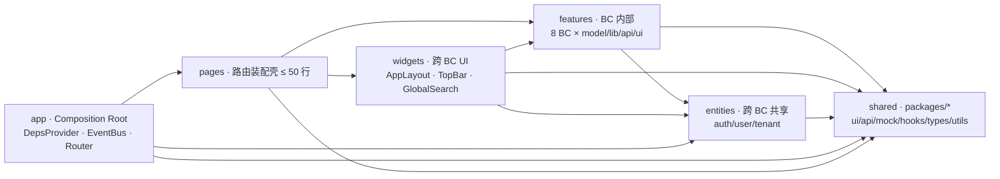
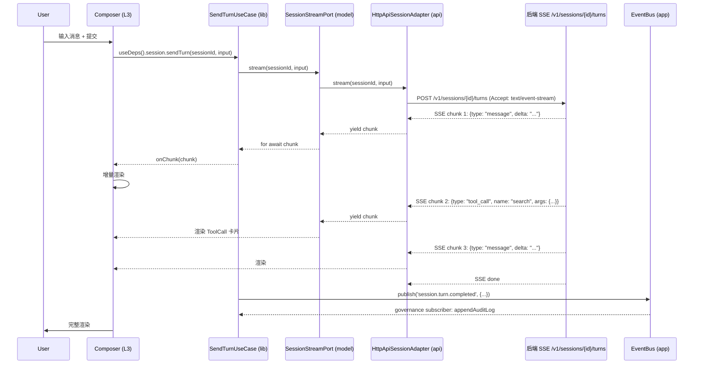
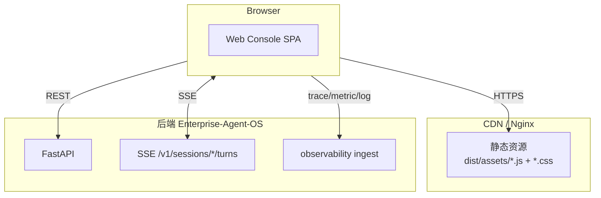

# 01 · 架构总览（FSD × DDD × Hex 三视角融合 · 对齐后端 8 模块）

> 前端架构与后端 8 模块 1:1 对齐；
> FSD 6 层（app/pages/widgets/features/entities/shared）+ DDD 8 BC（agent_runtime/session/skill/tool/knowledge/memory/governance/identity）+ Hexagonal Port/Adapter；
> 横切：observability / governance / auth；
> 流式核心：SSE Turn 渲染 + ToolCall 可视化。

> **基于 docs/web-refactor/01-架构总览.md 模板**。
> 与原模板差异：BC 边界与后端 modules/ 对齐；DTO 来自后端 OpenAPI Codegen；mock 与后端真实 handler 镜像；新增 channel / observability 横切。

---

## 1.1 设计目标

| 目标 | 说明 |
|---|---|
| **统一 Agent 视图** | 前端呈现所有类型 Agent（对话 / 任务 / 工作流 / 粗粒度）的统一形态：列表 + 详情 + 版本对比 + 调用 |
| **多租户可见** | Tenant / Workspace 两级在路由 + state + UI 三层显式体现 |
| **过程可观测** | trace_id 贯穿 SSE Turn；前端上报 metric / log / event 到后端 observability 模块 |
| **治理前置** | 前端拦截层（policy / approval / quota）必须不绕开——任何调用先过守卫 |
| **流式优先** | Turn / Message / ToolCall 全部 SSE 流式；前端要"看得到"过程 |
| **能力可插拔** | 后端模块可插拔在前端通过能力开关 + 路由懒加载 + dynamic import 体现 |
| **企业级可部署** | Vite 单 SPA + 静态托管；docker-compose 起 dev；K8s 静态 Pod |

---

## 1.2 核心概念

### 1.2.1 多租户层级（前端视角）

```
Platform
└── Tenant (租户，路由 / state 隔离)
    └── Workspace (工作区，store 维度 · URL 体现)
        └── Agent (Agent 列表 + 详情)
            └── AgentVersion (版本对比 + 调用绑定)
                └── Session (SSE 流式执行上下文)
                    └── Turn (单轮输入 + 完整响应)
                        ├── Message (文本片段)
                        ├── ToolCall (工具调用过程)
                        ├── SkillInvocation (Skill 执行)
                        └── MemoryWrite (记忆写入)
```

### 1.2.2 前端 Agent 闭环

```
┌─────────────────────────────────────────────────────────────┐
│                        Web Console                            │
│                                                              │
│   User ─▶ Composer ─▶ Session ─▶ Turn (SSE) ─▶ Response      │
│                  │                                            │
│                  └── trace_id 贯穿全链路                       │
└─────────────────────────────────────────────────────────────┘
                              │
       ┌──────────────────────┼──────────────────────┐
       ▼                      ▼                      ▼
   Governance            Observability           Auth/Tenant
   (approval modal)      (trace / cost)         (workspace switcher)
```

### 1.2.3 能力类型（前端视角）

| 能力 | 前端组件 | 路由 | 守卫 |
|---|---|---|---|
| **Agent** | AgentList / AgentDetail / AgentVersionCompare | `/agents` `/agents/:id` | RoleGuard |
| **Session** | SessionConsole / TurnStream / ToolCallTrace | `/sessions/:id` | WorkspaceGuard |
| **Tool** | ToolCatalog / ToolInvokeModal | `/tools` | RoleGuard |
| **Skill** | SkillCatalog / SkillRunResult | `/skills` | WorkspaceGuard |
| **Knowledge** | KnowledgeIngest / KnowledgeSearch | `/knowledge` | WorkspaceGuard |
| **Memory** | MemoryList / MemoryRecall | `/memory` | WorkspaceGuard |
| **Channel** | ChannelConfig / ChannelDeliveryLog | `/channels` | RoleGuard |
| **Governance** | PolicyEditor / ApprovalCenter / AuditLog | `/governance` | RoleGuard(admin/owner) |
| **Observability** | TraceViewer / CostDashboard / QualityDashboard | `/observability/*` | RoleGuard |
| **Identity** | TenantSwitcher / WorkspaceSwitcher / UserProfile | `/identity/*` | ProtectedRoute |

---

## 1.3 FSD 6 层依赖（前端）



> **强约束**：每个层只依赖其下方的层；同层仅可引用同 BC 或共享的 entities。

---

## 1.4 DDD 8 BC × FSD 切片

| BC | FSD 落点 | 类型 | 业务语言 | 后端 modules/ |
|---|---|---|---|---|
| **`agent_runtime`** | `features/agent_runtime/` | Core | Agent / AgentVersion / Plan / Response | `modules/agent_runtime/` |
| **`session`** | `features/session/` | Core | Session / Turn / Message / Stream | `modules/session/` |
| **`skill`** | `features/skill/` | Core | SkillPackage / SkillInvocation / RunToken | `modules/skill/` |
| **`tool`** | `features/tool/` | Core | Tool / ToolCall / ToolProtocol | `modules/tool/` |
| **`knowledge`** | `features/knowledge/` | Core | KnowledgePackage / Asset / Retriever | `modules/knowledge/` |
| **`memory`** | `features/memory/` | Supporting | MemoryEntry / Recall | `modules/memory/` |
| **`governance`** | `features/governance/` | Supporting | PolicyRule / Approval / AuditLog | `modules/governance/` |
| **`identity`** | `features/identity/` | Generic | Tenant / Workspace / User / Role | `modules/identity/` |
| **`channel`**（前端独有） | `features/channel/` | Supporting | Channel / ChannelDelivery（IM 运营配置） | （后端无对应模块） |
| **`observability`**（横切） | `web/src/widgets/observability/` + `app/observability/` | Supporting | TraceViewer / CostDashboard | `modules/observability/` |
| **`home`**（跨 BC 视图） | `widgets/home/` + `pages/home/` | 跨 BC | Composite UI | （前端独有） |

> **关键**：BC 名 = 后端模块名（同字面）；前端 DTO 来自后端 OpenAPI Codegen。

---

## 1.5 Hexagonal 六边形（每个 BC 内）

```mermaid
flowchart LR
  subgraph CORE[Hex 核心 · model/]
    ENTITY[Entity / Aggregate Root<br/>充血]
    VO[Value Object<br/>强类型 ID]
    PORT[Repository Port<br/>interface]
    EVENT[Domain Event<br/>readonly]
    ACL[ACL<br/>翻译上游]
    SERVICE[Domain Service]
  end
  subgraph APP[Hex application · lib/]
    UC[Use Case<br/>编排]
    HOOK[Hook<br/>React 包装]
  end
  subgraph ADAPTERS[Hex 适配器 · api/]
    HTTP[HttpApiAdapter<br/>生产]
    MOCK[MockApiAdapter<br/>dev/demo]
    LS[LocalStorageAdapter<br/>可选]
    EVENTAD[EventPublisher<br/>fire-and-forget]
  end
  subgraph OUTSIDE[外部]
    API[后端 API]
    MOCKSDK[@eos/web-mock]
    EVENTBUS[Global EventBus]
  end

  UC --> PORT
  UC --> SERVICE
  UC --> EVENT
  HOOK --> UC
  HTTP -.实现.-> PORT
  MOCK -.实现.-> PORT
  LS -.实现.-> PORT
  HTTP --> API
  MOCK --> MOCKSDK
  EVENTAD -.实现.-> EVENT
  EVENTAD --> EVENTBUS
```

### 1.5.1 BC 内部 FSD × DDD × Hex 映射

```
features/<bc>/
├── model/                              ← Hex 六边形核心（不依赖技术）
│   ├── entities/                       ← Aggregate / Entity（充血）
│   ├── value-objects/                  ← VO（强类型 ID / 枚举 / 品牌类型）
│   ├── repositories/                   ← Port 接口（仅 interface）
│   ├── services/                       ← Domain Service
│   ├── events/                         ← Domain Event 类型
│   └── acl/                            ← Anti-Corruption Layer
├── lib/                                ← Hex application（Use Case）
│   ├── use-cases/<Action>UseCase.ts    ← 编排 + 调 Port
│   └── hooks/<action>.ts               ← React 包装（useDeps + react-query）
├── api/                                ← Hex 适配器（inbound/outbound）
│   ├── adapters/
│   │   ├── HttpApiAdapter.ts           ← 生产：@eos/web-api 包装
│   │   ├── MockApiAdapter.ts           ← dev/demo：@eos/web-mock 包装
│   │   └── LocalStorageAdapter.ts      ← 可选：本地持久化
│   └── events/<X>EventPublisher.ts     ← EventBus 发布器适配器
└── ui/                                 ← FSD widgets（BC 内部复合 UI 块）
    ├── components/                     ← 视图组件
    ├── pages/                          ← 视图页（被 pages/ 装配壳引用）
    ├── store.ts                        ← UI 局部状态（非领域）
    └── navigation.ts                   ← 提供导航项给 AppLayout
```

---

## 1.6 三视角融合表（FSD × DDD × Hex）

| FSD 切片 | DDD 职责 | Hex 角色 | 行数上限 |
|---|---|---|---|
| `app/` | Composition Root | 装配 Port · 启动 · 路由 | — |
| `pages/` | 路由入口 | 装配壳（不调 Port） | ≤ 50 |
| `widgets/` | 跨 BC UI | 跨 BC inbound adapter | ≤ 400 |
| `features/<bc>/ui/` | BC 视图 | BC inbound adapter | ≤ 400 |
| `features/<bc>/lib/use-cases/` | Use Case | Hex application | ≤ 200 |
| `features/<bc>/lib/hooks/` | 业务 hook | Use Case 的 React 包装 | ≤ 150 |
| `features/<bc>/api/adapters/` | Port 实现 | Hex outbound adapter | ≤ 200 |
| `features/<bc>/model/` | Entity/VO/Repository/Event/ACL | Hex 核心 | ≤ 400 |
| `entities/` | 跨 BC 共享 | 跨 BC 共享 | ≤ 200 |
| `shared/` | 通用基础 | SDK / UI / Utils | 取决于包 |

---

## 1.7 SSE Turn 流式时序图（前端流式核心）



> **关键**：流式 chunk 在前端 **adapter 边界**进入；在 Use Case 暴露为 `AsyncIterable<TurnChunk>`；前端按 `chunk.type` 路由到不同渲染分支。

---

## 1.8 跨 BC 通信三选项（DDD Context Map）

| 场景 | 选项 | 示例 |
|---|---|---|
| **读其他 BC 数据** | Repository Port（经本 BC 的 Use Case） | agent_runtime 调 session.findById 拿 Session |
| **写其他 BC 数据** | Domain Event（fire-and-forget）+ ACL 翻译 | session 关闭后发 event，governance 订阅 |
| **共享数据** | Shared Kernel（`@eos/web-types` DTO） | SessionDTO 在 session / observability / governance 之间共用 |

> **禁止**：跨 BC 共享 zustand store；直接调 `@eos/web-mock` 业务代码；DTO 直接当 Entity 用。

---

## 1.9 横切关注点

| 横切 | FSD 落点 | DDD 视角 | Hex 视角 |
|---|---|---|---|
| **auth / tenant** | `web/src/entities/auth/` + `app/router/guards.tsx` | identity BC 横切 | app 层横切 |
| **observability** | `web/src/app/observability/`（trace 上报）+ `widgets/observability/`（viewer） | observability BC 横切 | app 层 + widgets 层 |
| **governance** | `app/router/governance-guards.tsx` + `lib/governance/` | governance BC 横切 | Use Case 调用前置拦截 |
| **i18n** | `packages/i18n/`（shared） + `entities/i18n/store.ts` | 横切 | — |
| **feature flag** | `@eos/web-utils/featureFlags` | 横切 | shared |
| **error boundary** | `widgets/error-boundary/` | 横切 | widgets |

---

## 1.10 部署拓扑（前端视角）



> 前端只发请求 + 拉 SSE；不上送任何业务状态（除 trace / metric）。

---

## 1.11 技术选型

| 层 | 选型 | 理由 |
|---|---|---|
| **包管理** | pnpm workspace | 物理隔离；与后端 uv workspace 平行的不同栈 |
| **构建** | Vite 5 | 快；HMR；与 pnpm 配合好 |
| **框架** | React 18 + TypeScript strict | 主流；与后端 TypeScript SDK 互用 |
| **路由** | React Router 6 | 主流；data router |
| **状态** | zustand + react-query | zustand 局部 UI；react-query 服务端态 |
| **UI** | Radix UI + Tailwind | 可访问性 + 灵活样式 |
| **SSE** | EventSource / fetch + ReadableStream | 兼容 + 流式 |
| **测试** | Vitest + Testing Library + Playwright | 单测 / 组件 / E2E |
| **E2E** | Playwright | 多浏览器 + 视频录制 |
| **Lint** | ESLint + import-linter | FSD 单向依赖 + Python import-linter 对齐 |
| **CI** | GitHub Actions | 与后端同一仓库 |
| **部署** | docker-compose（dev）+ K8s 静态 Pod（prod） | 与后端 deploy/ 对齐 |

---

## 1.12 与后端 enterprise-agent-os 的接口契约

| 项 | 契约 |
|---|---|
| **DTO 类型** | 后端 OpenAPI → TypeScript Codegen → `@eos/web-types`（前端共享） |
| **API 路径** | 后端 FastAPI 路由 /v1/*（详见后端 `06-接口规范`） |
| **认证** | Bearer Token + Tenant / Workspace 头（详见后端 `06-接口规范`） |
| **SSE** | 后端 EventSourceResponse；前端 ReadableStream |
| **错误码** | HTTP 4xx/5xx + 业务 error code（详见后端 `06-接口规范`） |
| **Mock** | 前端 `@eos/web-mock` 镜像后端真实 handler（共享 fixture） |

---

## 1.13 不在本节范围

- DTO 形态细节 → 见 [06-接口规范](06-接口规范.md)
- 部署细节 → 见 [11-部署与运行](11-部署与运行.md)
- 性能指标 → 见 [11-部署与运行](11-部署与运行.md)
- 风险与验收 → 见 [13-风险与验收](13-风险与验收.md)