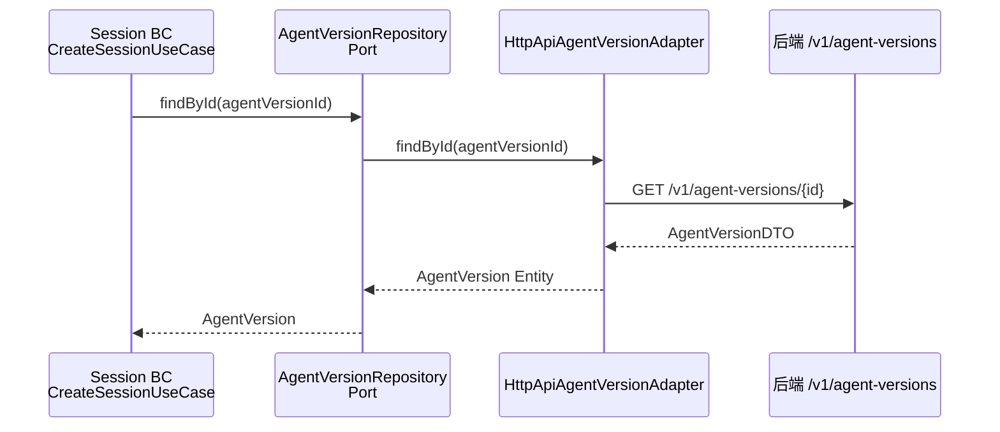
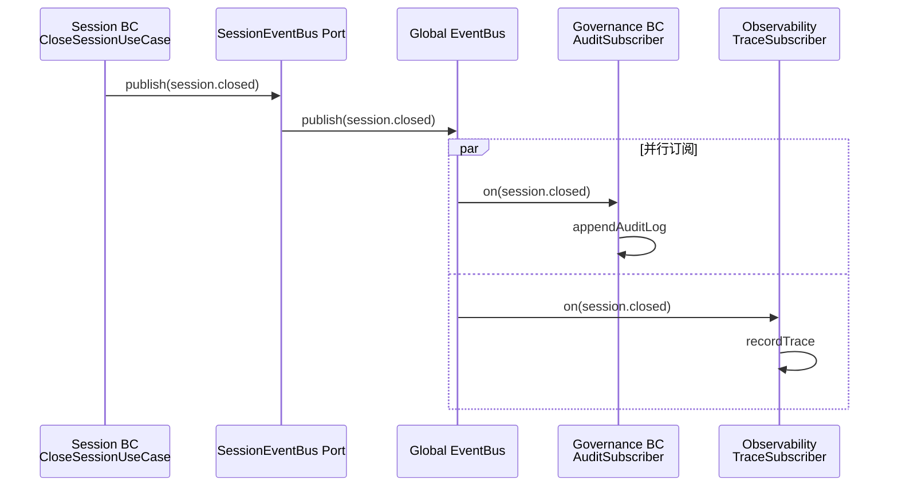
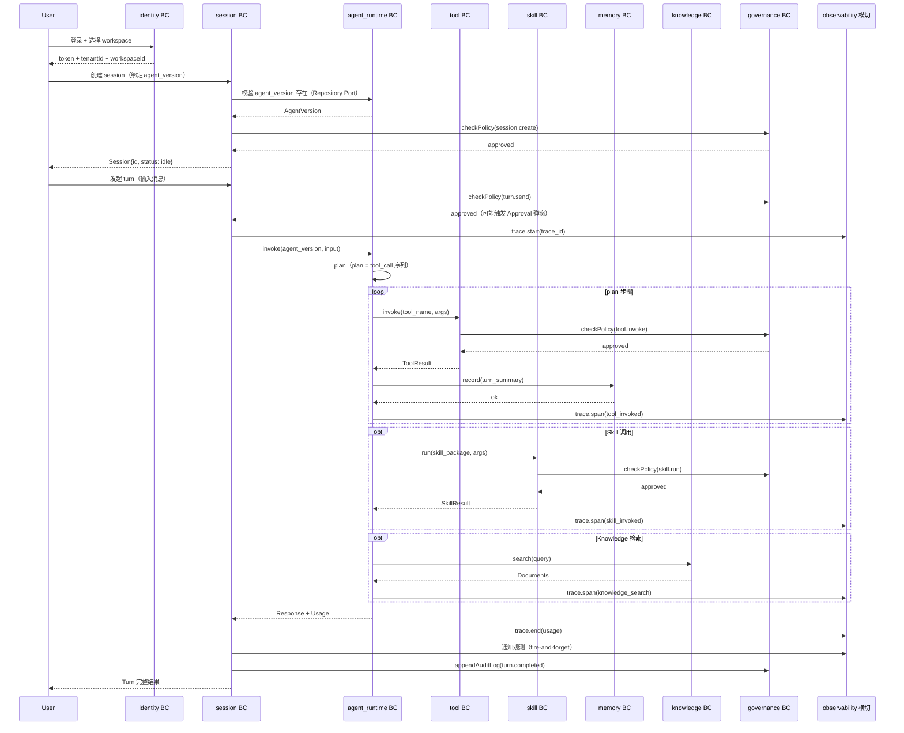

# 05 · 跨模块协作（Domain Event · ACL · EventBus · 八模块闭环可视化）

> 8 BC 之间的协作三选项：Repository Port（读）/ Domain Event（写）/ Shared Kernel（共享 DTO）
> ACL 在 `model/acl/<other-bc>.ts`；翻译规则是业务规则，必须有测试
> EventBus 在 `app/infrastructure/EventBus.ts`；subscribers 在 `app/composition/subscribers.ts` 集中注册
> 八模块闭环：User → Session → Agent Runtime → Skill / Tool / Memory / Knowledge → Response

> **基于 docs/web-refactor/05-pages与路由.md + 06-组件分层.md 模板**。
> 与原模板差异：聚焦跨 BC 协作；八模块闭环可视化（对齐后端）；与后端 `docs/enterprise-agent-os/05-跨模块协作.md` 平行阅读。

---

## 5.1 跨 BC 协作三选项（DDD Context Map）

### 5.1.1 选项 1 · 读其他 BC（Repository Port · Conformist）



```ts
// features/session/lib/use-cases/CreateSessionUseCase.ts
import type { AgentVersionRepository } from '@/features/agent_runtime/model/repositories/AgentVersionRepository';
import type { SessionRepository } from '../../model/repositories/SessionRepository';
import { AgentVersionId } from '@/features/agent_runtime/model/value-objects/AgentVersionId';

export interface CreateSessionDeps {
  agentVersionRepo: AgentVersionRepository;  // ← 跨 BC Port
  sessionRepo: SessionRepository;
}

export class CreateSessionUseCase {
  constructor(private readonly deps: CreateSessionDeps) {}

  async execute(input: { agentVersionId: string; workspaceId: string }): Promise<Session> {
    const av = await this.deps.agentVersionRepo.findById(new AgentVersionId(input.agentVersionId));
    if (!av) throw new Error('AgentVersion not found');
    return this.deps.sessionRepo.create({ agentVersionId: av.id.value, workspaceId: input.workspaceId });
  }
}
```

> **适用**：session 创建需校验 agent_version 存在；agent_runtime / knowledge 详情查询；identity 校验等
> **Hex 收益**：session 完全不知道 agent_runtime 的 api/memory 实现

### 5.1.2 选项 2 · 写其他 BC（Domain Event · 发布订阅）



```ts
// features/session/lib/use-cases/CloseSessionUseCase.ts
import type { SessionRepository } from '../../model/repositories/SessionRepository';
import type { SessionEventBus } from '../../model/events/SessionEventBus';

export class CloseSessionUseCase {
  constructor(
    private readonly sessionRepo: SessionRepository,
    private readonly eventBus: SessionEventBus,
  ) {}

  async execute(id: SessionId): Promise<void> {
    const session = await this.sessionRepo.findById(id);
    if (!session) throw new Error('Session not found');
    session.close();
    await this.sessionRepo.save(session);
    await this.eventBus.publish({
      type: 'session.closed',
      occurredAt: new Date().toISOString(),
      sessionId: id,
    });
  }
}
```

```ts
// features/governance/api/events/AuditLogSubscriber.ts
import { eventBus } from '@/app/infrastructure/EventBus';
import { appendAuditLog } from '@eos/web-api';
import type { SessionClosedEvent, ToolInvokedEvent } from '@eos/web-types';

export function registerAuditLogSubscriber(): () => void {
  const off1 = eventBus.on('session.closed', async (e: SessionClosedEvent) => {
    await appendAuditLog({ action: 'session.closed', sessionId: e.sessionId, occurredAt: e.occurredAt });
  });
  const off2 = eventBus.on('tool.invoked', async (e: ToolInvokedEvent) => {
    await appendAuditLog({ action: 'tool.invoked', toolId: e.toolId, args: e.args, occurredAt: e.occurredAt });
  });
  const off3 = eventBus.on('skill.invoked', async (e: SkillInvokedEvent) => {
    await appendAuditLog({ action: 'skill.invoked', skillId: e.skillId, occurredAt: e.occurredAt });
  });
  return () => { off1(); off2(); off3(); };
}
```

```ts
// web/src/app/composition/subscribers.ts
import { registerAuditLogSubscriber } from '@/features/governance/api/events/AuditLogSubscriber';
import { registerTraceSubscriber } from '@/widgets/observability/api/events/TraceSubscriber';

export function registerAllSubscribers(): () => void {
  const offs = [
    registerAuditLogSubscriber(),
    registerTraceSubscriber(),
  ];
  return () => offs.forEach(off => off());
}
```

> **适用**：session 关闭后写审计；tool/skill 调用后写审计 + 上报 trace；memory 写入后写审计
> **核心**：fire-and-forget；发布者不知道订阅者是谁

### 5.1.3 选项 3 · 共享数据（Shared Kernel · @eos/web-types）

```ts
// packages/types/src/session.ts（来自后端 OpenAPI Codegen）
export interface SessionDTO {
  id: string;
  agent_version_id: string;
  workspace_id: string;
  status: 'idle' | 'running' | 'closed';
  created_at: string;
  turns: TurnDTO[];
}
```

> **适用**：SessionDTO 在 session / observability / governance / home 共用
> **关键**：DTO 是 Shared Kernel；Entity 是 BC 内部；DTO ↔ Entity 在 adapter 边界转换

---

## 5.2 八模块闭环可视化（对齐后端）

### 5.2.1 一次完整 Turn 的事件链



### 5.2.2 八模块事件一览

| 事件 | 发布 BC | 订阅 BC（推荐） | 触发 |
|---|---|---|---|
| `session.created` | session | governance, observability | 创建 session |
| `session.turn.started` | session | observability | turn 开始 |
| `session.turn.completed` | session | governance, observability, memory | turn 完成 |
| `session.closed` | session | governance, observability | 关闭 session |
| `agent_version.published` | agent_runtime | session, governance | 发布新版本 |
| `tool.invoked` | tool | governance, observability | 工具调用 |
| `skill.invoked` | skill | governance, observability | skill 执行 |
| `knowledge.searched` | knowledge | observability | 检索 |
| `memory.recorded` | memory | governance | 写入记忆 |
| `policy.violated` | governance | observability | 违反策略 |
| `approval.requested` | governance | （前端 modal 弹出） | 请求审批 |
| `approval.granted` | governance | （继续原 Use Case） | 审批通过 |
| `cost.threshold_exceeded` | observability | governance | 成本超阈值 |

> **核心**：前端事件不阻塞业务；fire-and-forget。

---

## 5.3 ACL（Anti-Corruption Layer）规范

### 5.3.1 ACL 在 model 层

```
features/<bc>/model/acl/
├── <other-bc-1>.ts        # 翻译 other-bc-1 的 DTO 到本 BC 输入
├── <other-bc-2>.ts        # 翻译 other-bc-2 的 DTO 到本 BC 输入
└── ...
```

### 5.3.2 ACL 函数模板

```ts
// features/session/model/acl/agent_runtime.ts
import type { AgentVersionSummaryDTO } from '@eos/web-types';
import type { SessionCreateInput } from '../types';

export function mapAgentVersionToSessionCreateInput(
  av: AgentVersionSummaryDTO,
  workspaceId: string,
): SessionCreateInput {
  if (av.status !== 'published') {
    throw new Error(`AgentVersion ${av.id} is not published (status=${av.status})`);
  }
  return {
    agentVersionId: av.id,
    workspaceId,
    model: av.model,
    temperature: av.defaultTemperature ?? 0.7,
  };
}
```

### 5.3.3 ACL 测试

```ts
// features/session/model/acl/agent_runtime.test.ts
describe('mapAgentVersionToSessionCreateInput', () => {
  it('maps a published AgentVersion', () => {
    const av: AgentVersionSummaryDTO = {
      id: 'agv_001',
      status: 'published',
      model: 'gpt-4',
      defaultTemperature: 0.5,
    };
    const input = mapAgentVersionToSessionCreateInput(av, 'ws_001');
    expect(input).toEqual({
      agentVersionId: 'agv_001',
      workspaceId: 'ws_001',
      model: 'gpt-4',
      temperature: 0.5,
    });
  });

  it('throws when AgentVersion is not published', () => {
    const av: AgentVersionSummaryDTO = {
      id: 'agv_001',
      status: 'draft',
      model: 'gpt-4',
    };
    expect(() => mapAgentVersionToSessionCreateInput(av, 'ws_001'))
      .toThrow('not published');
  });

  it('falls back to default temperature', () => {
    const av: AgentVersionSummaryDTO = {
      id: 'agv_001',
      status: 'published',
      model: 'gpt-4',
    };
    const input = mapAgentVersionToSessionCreateInput(av, 'ws_001');
    expect(input.temperature).toBe(0.7);
  });
});
```

### 5.3.4 ACL 落点表

| 本 BC | 上游 BC | ACL 文件 | 翻译方向 |
|---|---|---|---|
| session | agent_runtime | `acl/agent_runtime.ts` | AgentVersion → SessionCreateInput |
| session | identity | `acl/identity.ts` | User → Session actor |
| governance | session | `acl/session.ts` | Session → AuditEntry |
| governance | tool | `acl/tool.ts` | ToolCall → AuditEntry |
| governance | skill | `acl/skill.ts` | SkillInvocation → AuditEntry |
| memory | session | `acl/session.ts` | Session → MemoryEntry |
| knowledge | session | `acl/session.ts` | Session → IngestInput |
| channel | session | `acl/session.ts` | Session → ChannelDelivery |

---

## 5.4 EventBus 规范

### 5.4.1 全局 EventBus

```ts
// web/src/app/infrastructure/EventBus.ts
type Handler<T = unknown> = (event: T) => void | Promise<void>;

export class InMemoryEventBus {
  private handlers = new Map<string, Set<Handler>>();

  on<T>(type: string, handler: Handler<T>): () => void {
    let set = this.handlers.get(type);
    if (!set) { set = new Set(); this.handlers.set(type, set); }
    set.add(handler as Handler);
    return () => set!.delete(handler as Handler);
  }

  async publish<T>(event: { type: string } & T): Promise<void> {
    const set = this.handlers.get(event.type);
    if (!set) return;
    await Promise.allSettled([...set].map(h => h(event)));
  }
}

export const eventBus = new InMemoryEventBus();
```

### 5.4.2 Event 类型规范

```ts
// features/<bc>/model/events/<X>Events.ts
export interface <X>Event {
  readonly type: '<bc>.<action>';          // 严格命名空间
  readonly occurredAt: string;              // ISO 8601
  readonly sessionId?: SessionId;            // 可选：业务负载
  readonly payload?: Record<string, unknown>;
}

export type <BC>AllEvents = <X>Event | <Y>Event | ...;

// 例：
export interface SessionTurnCompletedEvent {
  readonly type: 'session.turn.completed';  // 命名空间：<bc>.<action>
  readonly occurredAt: string;
  readonly sessionId: SessionId;
  readonly turnId: number;
  readonly usage: { input: number; output: number };
}
```

### 5.4.3 EventBus Port（BC 边界）

```ts
// features/<bc>/model/events/<X>EventBus.ts
import type { <BC>AllEvents } from './<X>Events';

export interface <X>EventBus {
  publish(event: <BC>AllEvents): Promise<void>;
}
```

```ts
// features/<bc>/api/events/InMemory<X>EventPublisher.ts
import { eventBus } from '@/app/infrastructure/EventBus';
import type { <BC>AllEvents } from '../../model/events/<X>Events';
import type { <X>EventBus } from '../../model/events/<X>EventBus';

export class InMemory<X>EventPublisher implements <X>EventBus {
  async publish(event: <BC>AllEvents): Promise<void> {
    void eventBus.publish(event);
  }
}
```

> **核心**：BC 通过 `<X>EventBus` Port 发布；不直接接触全局 eventBus；适配器在 `api/events/`

### 5.4.4 订阅者注册（集中）

```ts
// web/src/app/composition/subscribers.ts
import { registerAuditLogSubscriber } from '@/features/governance/api/events/AuditLogSubscriber';
import { registerTraceSubscriber } from '@/widgets/observability/api/events/TraceSubscriber';
import { registerCostSubscriber } from '@/widgets/observability/api/events/CostSubscriber';

export function registerAllSubscribers(): () => void {
  const offs = [
    registerAuditLogSubscriber(),
    registerTraceSubscriber(),
    registerCostSubscriber(),
  ];
  return () => offs.forEach(off => off());
}
```

```tsx
// web/src/app/App.tsx
export function App() {
  useEffect(() => {
    const unregister = registerAllSubscribers();
    return unregister;
  }, []);
  return <RouterProvider router={router} />;
}
```

### 5.4.5 跨标签页 EventBus（远期 BroadcastChannel）

```ts
// web/src/app/infrastructure/broadcast.ts（远期）
export function withBroadcast(bus: InMemoryEventBus, channel: string): void {
  const bc = new BroadcastChannel(channel);
  const originalPublish = bus.publish.bind(bus);
  bus.publish = async function (event) {
    bc.postMessage(event);
    return originalPublish(event);
  };
  bc.onmessage = (e) => originalPublish(e.data);
}
```

---

## 5.5 跨 BC 状态（Domain Event · 推荐）

### 5.5.1 禁止：跨 BC 共享 zustand store

```ts
// ❌ 反例：session 在 governance 的 store 里读
import { useGovernanceStore } from '@/features/governance/ui/store';
const pendingApprovals = useGovernanceStore(s => s.pendingApprovals);  // ← 跨 BC 反向依赖
```

### 5.5.2 推荐：跨 BC 状态在 widgets 层

```ts
// ✅ 推荐：home widgets 聚合多 BC 数据
// web/src/widgets/home/components/RecentActivity.tsx
import { useListSessions } from '@/features/session/lib/hooks/useListSessions';
import { useListToolInvocations } from '@/features/tool/lib/hooks/useListToolInvocations';

export function RecentActivity() {
  const sessions = useListSessions();
  const toolCalls = useListToolInvocations();
  return <List items={[...sessions, ...toolCalls]} />;
}
```

### 5.5.3 推荐：跨 BC 实时（Domain Event 订阅）

```ts
// ✅ 推荐：home widgets 订阅 session.closed 实时刷新
import { eventBus } from '@/app/infrastructure/EventBus';

export function useRecentActivityRealtime(refresh: () => void) {
  useEffect(() => {
    const off = eventBus.on('session.closed', refresh);
    return off;
  }, [refresh]);
}
```

---

## 5.6 治理横切（governance · frontend interceptor）

### 5.6.1 policy 拦截（在 lib/use-cases/ 编排）

```ts
// features/session/lib/use-cases/SendTurnUseCase.ts
import type { PolicyCheckPort } from '@/features/governance/model/ports/PolicyCheckPort';

export interface SendTurnDeps {
  sessionRepo: SessionRepository;
  streamPort: SessionStreamPort;
  eventBus: SessionEventBus;
  policyCheck: PolicyCheckPort;  // ← governance 拦截
}

export class SendTurnUseCase {
  constructor(private readonly deps: SendTurnDeps) {}

  async *execute(sessionId: SessionId, content: string): AsyncIterable<unknown> {
    // 前置：policy 检查
    const check = await this.deps.policyCheck.check({
      action: 'session.turn.send',
      actor: getCurrentUser(),
      target: { type: 'session', id: sessionId.value },
      context: { content },
    });
    if (!check.allowed) {
      if (check.requiresApproval) {
        throw new PolicyViolationError({ reason: check.reason, approvalUrl: check.approvalUrl });
      }
      throw new PolicyViolationError({ reason: check.reason });
    }
    // ... 业务逻辑
  }
}
```

### 5.6.2 approval modal 拦截（前端）

```tsx
// features/governance/ui/components/ApprovalModal.tsx
import { useState } from 'react';

export function ApprovalModal({
  approvalUrl,
  onApprove,
  onReject,
}: {
  approvalUrl: string;
  onApprove: () => void;
  onReject: () => void;
}) {
  return (
    <Modal>
      <p>该操作需要审批</p>
      <button onClick={onApprove}>前往审批</button>
      <button onClick={onReject}>拒绝</button>
    </Modal>
  );
}
```

```tsx
// features/session/ui/components/CopilotPanel.tsx
const sendTurn = useSendTurnWithApproval();  // 自定义 hook

const onSend = async (input: string) => {
  try {
    await sendTurn.send({ sessionId, content: input });
  } catch (e) {
    if (e instanceof PolicyViolationError && e.approvalUrl) {
      openApprovalModal({ approvalUrl: e.approvalUrl });
    }
  }
};
```

---

## 5.7 可观测性横切（observability · 上报 + 查看）

### 5.7.1 前端 trace 上报

```ts
// web/src/app/observability/reporter.ts
import { api } from '@eos/web-api';
import type { TraceDTO, MetricDTO, LogDTO } from '@eos/web-types';

export class ObservabilityReporter {
  reportTrace(trace: TraceDTO): void {
    void api.observability.ingestTrace(trace);
  }
  reportMetric(metric: MetricDTO): void {
    void api.observability.ingestMetric(metric);
  }
  reportLog(log: LogDTO): void {
    void api.observability.ingestLog(log);
  }
}

export const observabilityReporter = new ObservabilityReporter();
```

```ts
// web/src/app/observability/trace.ts
export class TraceContext {
  private current: string | null = null;

  start(traceId: string): void {
    this.current = traceId;
    sessionStorage.setItem('trace_id', traceId);
  }

  end(): void {
    this.current = null;
    sessionStorage.removeItem('trace_id');
  }

  get(): string | null {
    return this.current;
  }
}

export const traceContext = new TraceContext();
```

### 5.7.2 SSE 客户端注入 trace_id

```ts
// packages/api/src/client.ts（在 SSE 头注入 X-Trace-Id）
const traceId = traceContext.get();
if (traceId) headers['X-Trace-Id'] = traceId;
```

### 5.7.3 TraceViewer（widgets）

```tsx
// web/src/widgets/observability/TraceViewer.tsx
import { useQuery } from '@tanstack/react-query';
import { api } from '@eos/web-api';

export function TraceViewer({ traceId }: { traceId: string }) {
  const { data: trace } = useQuery({
    queryKey: ['trace', traceId],
    queryFn: () => api.observability.getTrace(traceId),
  });
  if (!trace) return <Skeleton />;
  return (
    <Timeline>
      {trace.spans.map(span => (
        <Span key={span.id} {...span} />
      ))}
    </Timeline>
  );
}
```

### 5.7.4 CostDashboard（widgets）

```tsx
// web/src/widgets/observability/CostDashboard.tsx
export function CostDashboard({ workspaceId }: { workspaceId: string }) {
  const { data: costs } = useQuery({
    queryKey: ['costs', workspaceId],
    queryFn: () => api.observability.getCosts(workspaceId),
  });
  return (
    <KpiCards>
      <KpiCard label="今日成本" value={costs?.today} />
      <KpiCard label="本月成本" value={costs?.month} />
      <KpiCard label="超阈值" value={costs?.overThreshold} />
    </KpiCards>
  );
}
```

---

## 5.8 Context Map 矩阵（前端视角）

| 来源 \ → 目标 | session | agent_runtime | tool | skill | knowledge | memory | governance | identity |
|---|---|---|---|---|---|---|---|---|
| **session** | — | CS（客户提供） | — | — | CS | CS | SE（订阅事件） | CS |
| **agent_runtime** | CS | — | — | — | — | — | SE | CS |
| **tool** | — | — | — | — | — | — | SE | — |
| **skill** | — | — | — | — | — | — | SE | — |
| **knowledge** | CS | CS | — | — | — | — | SE | — |
| **memory** | ACL | — | — | — | — | — | SE | — |
| **governance** | （横切拦截） | （横切拦截） | （横切拦截） | （横切拦截） | （横切拦截） | （横切拦截） | — | — |
| **identity** | CS | CS | CS | CS | CS | CS | CS | — |

| 关系 | 含义 | 实现 |
|---|---|---|
| **CS** (Customer-Supplier) | 上游 BC，下游 BC 适配 | 上游 DTO → ACL 函数 → 下游 Entity/VO |
| **SK** (Shared Kernel) | 共享代码 | `@eos/web-types` 共用 DTO |
| **SE** (Subscriber) | 事件订阅 | Domain Event + EventBus |
| **ACL** | 反腐层 | `model/acl/<other-bc>.ts` |
| **横切拦截** | governance 横切 | Use Case 编排 + PolicyCheckPort |

> **核心**：前端 CS 关系全部走 ACL 函数翻译；不直接用上游 DTO。

---

## 5.9 端到端场景：发一条 turn

```
User                        前端 BC                           后端
 │                            │                                │
 ├─ 输入消息 ─────────────────▶│                                │
 │                            ├─ Composer (session/ui)         │
 │                            │                                │
 │                            ├─ useSendTurn (session/lib)     │
 │                            │                                │
 │                            ├─ SendTurnUseCase.execute       │
 │                            │   ├─ policyCheck.check         │
 │                            │   │   (governance/lib)         │
 │                            │   │     └─ ApiClient.request   ├──────────▶ governance service
 │                            │   │     ◀────── allowed ───────│
 │                            │   ├─ eventBus.publish           │
 │                            │   │   'session.turn.started'    │
 │                            │   │   ├─▶ AuditLogSubscriber   │
 │                            │   │   └─▶ TraceSubscriber      │
 │                            │   ├─ streamPort.stream         │
 │                            │   │   (session/api)            │
 │                            │   │     └─ api.session.streamTurn
 │                            │   │       (HttpApiAdapter)     ├──────────▶ /v1/sessions/{id}/turns (SSE)
 │                            │   │                             │  ◀────── chunk 1: message ────
 │                            │   │   yield chunk               │  ◀────── chunk 2: tool_call ─
 │                            │   │   ├─ message 渲染            │  ◀────── chunk 3: message ─
 │                            │   │   └─ tool_call 渲染          │
 │                            │   │                             │  ◀────── chunk 4: done ─────
 │                            │   ├─ eventBus.publish           │
 │                            │   │   'session.turn.completed'  │
 │ ◀────── 完整渲染 ──────────┤   └─ return chunks              │
```

> **关键**：前端事件流与后端事件流**平行**；前端 fire-and-forget 不阻塞 SSE 渲染。

---

## 5.10 不在本节范围

- pages 装配壳 → 见 [06-接口规范](06-接口规范.md) + [07-组合根与启动](07-组合根与启动.md)
- 组件分层（L0/L1/L2/L3）→ 见 [01-架构总览](01-架构总览.md)
- 路由守卫细节 → 见 [07-组合根与启动](07-组合根与启动.md)
- 测试覆盖 → 见 [10-测试与CI](10-测试与CI.md)