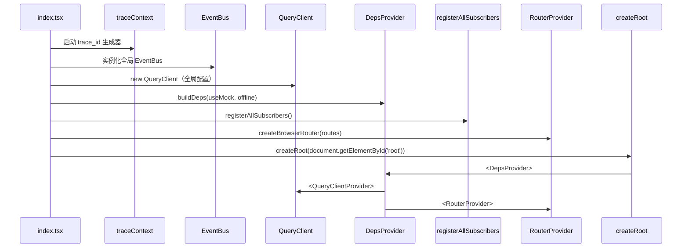

# 07 · 组合根与启动（Composition Root · DepsProvider · EventBus · Router · Guards）

> web/src/app/ 是 FSD app 层 · Hex Composition Root
> 装配所有 BC 的 Port 实现（HttpApi/Mock/LocalStorage 三选一）
> 启动顺序：traceId → EventBus → QueryClient → DepsProvider → SubscriberRegistry → Router → Mount
> 路由表 + 守卫集中管理
> 与后端 enterprise-agent-os/composition/ 平行

> **基于 docs/web-refactor/07-状态管理.md 模板**。
> 与原模板差异：聚焦 Composition Root · DepsProvider · Router 装配；8 BC × 三类适配器装配；与后端 composition/ 平行阅读。

---

## 7.1 app 层职责

```
web/src/app/
├── composition/                        # 装配
│   ├── adapters.ts                     # 装配所有 BC 的 Port 实现
│   ├── subscribers.ts                  # 跨 BC Domain Event 订阅注册
│   ├── DepsContext.ts                  # React Context for AppDeps
│   └── useDeps.ts                      # hook
├── providers/                          # 全局 Provider
│   ├── DepsProvider.tsx                # 注入 AppDeps
│   ├── QueryProvider.tsx               # react-query
│   ├── I18nProvider.tsx
│   └── ObservabilityProvider.tsx
├── router/                             # 路由
│   ├── index.tsx                       # 路由表
│   ├── guards.tsx                      # Protected / Workspace / Role / Tenant / Governance
│   └── error-boundary.tsx
├── observability/                      # 横切 · trace / metric / log
│   ├── reporter.ts
│   ├── trace.ts
│   ├── metric.ts
│   ├── log.ts
│   └── context.ts
├── infrastructure/                     # 基础设施
│   ├── EventBus.ts
│   └── broadcast.ts
├── App.tsx
└── index.tsx                           # 入口（启动顺序）
```

---

## 7.2 启动顺序



---

## 7.3 Composition Root（buildDeps）

### 7.3.1 适配器装配（Hex 视角）

```ts
// web/src/app/composition/adapters.ts
import { HttpApiSessionAdapter } from '@/features/session/api/adapters/HttpApiAdapter';
import { MockApiSessionAdapter } from '@/features/session/api/adapters/MockApiAdapter';
import { LocalStorageSessionAdapter } from '@/features/session/api/adapters/LocalStorageAdapter';
import { InMemorySessionEventPublisher } from '@/features/session/api/events/SessionEventPublisher';

import { HttpApiAgentRuntimeAdapter } from '@/features/agent_runtime/api/adapters/HttpApiAdapter';
import { MockApiAgentRuntimeAdapter } from '@/features/agent_runtime/api/adapters/MockApiAdapter';

import { HttpApiToolAdapter } from '@/features/tool/api/adapters/HttpApiAdapter';
import { MockApiToolAdapter } from '@/features/tool/api/adapters/MockApiAdapter';

import { HttpApiSkillAdapter } from '@/features/skill/api/adapters/HttpApiAdapter';
import { MockApiSkillAdapter } from '@/features/skill/api/adapters/MockApiAdapter';

import { HttpApiKnowledgeAdapter } from '@/features/knowledge/api/adapters/HttpApiAdapter';
import { MockApiKnowledgeAdapter } from '@/features/knowledge/api/adapters/MockApiAdapter';

import { HttpApiMemoryAdapter } from '@/features/memory/api/adapters/HttpApiAdapter';
import { MockApiMemoryAdapter } from '@/features/memory/api/adapters/MockApiAdapter';

import { HttpApiGovernanceAdapter } from '@/features/governance/api/adapters/HttpApiAdapter';
import { MockApiGovernanceAdapter } from '@/features/governance/api/adapters/MockApiAdapter';

import { HttpApiIdentityAdapter } from '@/features/identity/api/adapters/HttpApiAdapter';
import { MockApiIdentityAdapter } from '@/features/identity/api/adapters/MockApiAdapter';

import { HttpApiChannelAdapter } from '@/features/channel/api/adapters/HttpApiAdapter';
import { MockApiChannelAdapter } from '@/features/channel/api/adapters/MockApiAdapter';

import type { SessionRepository, SessionStreamPort } from '@/features/session/model/repositories/SessionRepository';
import type { AgentVersionRepository } from '@/features/agent_runtime/model/repositories/AgentVersionRepository';
import type { ToolRepository } from '@/features/tool/model/repositories/ToolRepository';
import type { SkillPackageRepository } from '@/features/skill/model/repositories/SkillPackageRepository';
import type { KnowledgeRepository } from '@/features/knowledge/model/repositories/KnowledgeRepository';
import type { MemoryRepository } from '@/features/memory/model/repositories/MemoryRepository';
import type { PolicyCheckPort } from '@/features/governance/model/ports/PolicyCheckPort';
import type { IdentityPort } from '@/features/identity/model/ports/IdentityPort';
import type { ChannelRepository } from '@/features/channel/model/repositories/ChannelRepository';

export interface AppDeps {
  session: {
    sessionRepo: SessionRepository;
    streamPort: SessionStreamPort;
    eventBus: SessionEventBus;
  };
  agent_runtime: {
    agentVersionRepo: AgentVersionRepository;
  };
  tool: {
    toolRepo: ToolRepository;
  };
  skill: {
    skillRepo: SkillPackageRepository;
  };
  knowledge: {
    knowledgeRepo: KnowledgeRepository;
  };
  memory: {
    memoryRepo: MemoryRepository;
  };
  governance: {
    policyCheck: PolicyCheckPort;
  };
  identity: {
    identity: IdentityPort;
  };
  channel: {
    channelRepo: ChannelRepository;
  };
}

export type AdapterMode = 'http' | 'mock' | 'local';

export function buildDeps(mode: AdapterMode): AppDeps {
  const pick = <H, M, L>(Http: new (...args: any[]) => H, Mock: new (...args: any[]) => M, Local: new (...args: any[]) => L): H | M | L => {
    if (mode === 'mock') return new Mock();
    if (mode === 'local') return new Local();
    return new Http();
  };

  return {
    session: {
      sessionRepo: pick(HttpApiSessionAdapter, MockApiSessionAdapter, LocalStorageSessionAdapter),
      streamPort: pick(HttpApiSessionAdapter, MockApiSessionAdapter, LocalStorageSessionAdapter),
      eventBus: new InMemorySessionEventPublisher(),
    },
    agent_runtime: {
      agentVersionRepo: pick(HttpApiAgentRuntimeAdapter, MockApiAgentRuntimeAdapter, LocalStorageAgentRuntimeAdapter),
    },
    tool: {
      toolRepo: pick(HttpApiToolAdapter, MockApiToolAdapter, LocalStorageToolAdapter),
    },
    skill: {
      skillRepo: pick(HttpApiSkillAdapter, MockApiSkillAdapter, LocalStorageSkillAdapter),
    },
    knowledge: {
      knowledgeRepo: pick(HttpApiKnowledgeAdapter, MockApiKnowledgeAdapter, LocalStorageKnowledgeAdapter),
    },
    memory: {
      memoryRepo: pick(HttpApiMemoryAdapter, MockApiMemoryAdapter, LocalStorageMemoryAdapter),
    },
    governance: {
      policyCheck: pick(HttpApiGovernanceAdapter, MockApiGovernanceAdapter, LocalStorageGovernanceAdapter),
    },
    identity: {
      identity: pick(HttpApiIdentityAdapter, MockApiIdentityAdapter, LocalStorageIdentityAdapter),
    },
    channel: {
      channelRepo: pick(HttpApiChannelAdapter, MockApiChannelAdapter, LocalStorageChannelAdapter),
    },
  };
}
```

### 7.3.2 模式决策（按 token / 离线状态）

```ts
// web/src/app/composition/resolveMode.ts
import { isMockToken } from '@/dev/mock-tokens';
import { useOfflineMode } from '@/hooks/useOnline';

export function resolveMode(): AdapterMode {
  if (useOfflineMode()) return 'local';

  const useMock = import.meta.env.VITE_USE_MOCK === '1';
  if (useMock) return 'mock';

  const token = useAuthStore.getState().token;
  if (token && isMockToken(token)) return 'mock';

  return 'http';
}
```

---

## 7.4 DepsProvider

### 7.4.1 注入 AppDeps

```tsx
// web/src/app/providers/DepsProvider.tsx
import { createContext, useMemo, useState, useEffect } from 'react';
import { buildDeps, type AppDeps, type AdapterMode } from '../composition/adapters';
import { resolveMode } from '../composition/resolveMode';

const DepsContext = createContext<AppDeps | null>(null);

export function DepsProvider({ children }: { children: React.ReactNode }) {
  const [mode, setMode] = useState<AdapterMode>(() => resolveMode());

  // 监听 token 变化、online/offline 变化，重新计算 mode
  useEffect(() => {
    const unsubAuth = useAuthStore.subscribe(() => setMode(resolveMode()));
    const handleOnline = () => setMode(resolveMode());
    window.addEventListener('online', handleOnline);
    window.addEventListener('offline', handleOnline);
    return () => {
      unsubAuth();
      window.removeEventListener('online', handleOnline);
      window.removeEventListener('offline', handleOnline);
    };
  }, []);

  const deps = useMemo(() => buildDeps(mode), [mode]);
  return <DepsContext.Provider value={deps}>{children}</DepsContext.Provider>;
}

export function useDeps(): AppDeps {
  const deps = useContext(DepsContext);
  if (!deps) throw new Error('useDeps must be used within DepsProvider');
  return deps;
}
```

### 7.4.2 与 react-query 集成

```tsx
// web/src/app/providers/QueryProvider.tsx
import { QueryClient, QueryClientProvider } from '@tanstack/react-query';

const queryClient = new QueryClient({
  defaultOptions: {
    queries: {
      staleTime: 60_000,
      gcTime: 5 * 60_000,
      retry: 1,
      refetchOnWindowFocus: false,
    },
  },
});

export function QueryProvider({ children }: { children: React.ReactNode }) {
  return <QueryClientProvider client={queryClient}>{children}</QueryClientProvider>;
}
```

---

## 7.5 路由表（FSD app · web/src/app/router/）

### 7.5.1 路由装配

```tsx
// web/src/app/router/index.tsx
import { createBrowserRouter, Navigate } from 'react-router-dom';
import { AppLayout } from '@/widgets/app-layout';
import { ProtectedRoute, WorkspaceGuard, RoleGuard, TenantGuard } from './guards';

import { HomeRoute } from '@/pages/Home';
import { LoginRoute } from '@/pages/Login';
import { AgentsRoute } from '@/pages/Agents';
import { SessionsRoute } from '@/pages/Sessions';
import { ToolsRoute } from '@/pages/Tools';
import { SkillsRoute } from '@/pages/Skills';
import { KnowledgeRoute } from '@/pages/Knowledge';
import { MemoryRoute } from '@/pages/Memory';
import { ChannelsRoute } from '@/pages/Channels';
import { GovernanceRoute } from '@/pages/Governance';
import { ObservabilityRoute } from '@/pages/Observability';
import { SettingsRoute } from '@/pages/Settings';
import { ErrorRoute } from '@/pages/Error';

export const router = createBrowserRouter([
  { path: '/login', element: <LoginRoute /> },

  {
    path: '/',
    element: (
      <ProtectedRoute>
        <TenantGuard>
          <WorkspaceGuard>
            <AppLayout />
          </WorkspaceGuard>
        </TenantGuard>
      </ProtectedRoute>
    ),
    errorElement: <ErrorRoute />,
    children: [
      { index: true, element: <HomeRoute /> },
      { path: 'agents', element: <AgentsRoute /> },
      { path: 'sessions', element: <SessionsRoute /> },
      { path: 'sessions/:id', element: <SessionsRoute /> },
      { path: 'tools', element: <ToolsRoute /> },
      { path: 'skills', element: <SkillsRoute /> },
      { path: 'knowledge', element: <KnowledgeRoute /> },
      { path: 'memory', element: <MemoryRoute /> },
      { path: 'channels', element: <ChannelsRoute /> },
      { path: 'governance', element: <GovernanceRoute /> },
      {
        path: 'observability',
        element: (
          <RoleGuard roles={['admin', 'owner', 'operator']}>
            <ObservabilityRoute />
          </RoleGuard>
        ),
      },
      {
        path: 'settings',
        element: (
          <RoleGuard roles={['admin', 'owner']}>
            <SettingsRoute />
          </RoleGuard>
        ),
      },
    ],
  },
  { path: '*', element: <Navigate to="/" replace /> },
]);
```

### 7.5.2 守卫

```tsx
// web/src/app/router/guards.tsx
import { Navigate, useLocation } from 'react-router-dom';
import { useAuthStore } from '@/entities/auth/store';
import { useTenantStore } from '@/entities/tenant/store';
import { useWorkspaceStore } from '@/entities/workspace/store';

/** 登录态守卫 */
export function ProtectedRoute({ children }: { children: React.ReactNode }) {
  const token = useAuthStore(s => s.token);
  const location = useLocation();
  if (!token) return <Navigate to="/login" state={{ from: location }} replace />;
  return <>{children}</>;
}

/** Tenant 守卫 */
export function TenantGuard({ children }: { children: React.ReactNode }) {
  const tenantId = useTenantStore(s => s.currentTenantId);
  if (!tenantId) return <Navigate to="/select-tenant" replace />;
  return <>{children}</>;
}

/** Workspace 守卫 */
export function WorkspaceGuard({ children }: { children: React.ReactNode }) {
  const workspaceId = useWorkspaceStore(s => s.currentWorkspaceId);
  if (!workspaceId) return <Navigate to="/select-workspace" replace />;
  return <>{children}</>;
}

/** Role 守卫 */
export function RoleGuard({ roles, children }: { roles: readonly Role[]; children: React.ReactNode }) {
  const user = useAuthStore(s => s.user);
  if (!user || !roles.includes(user.role)) return <Navigate to="/403" replace />;
  return <>{children}</>;
}
```

### 7.5.3 守卫组合

```
顺序：ProtectedRoute → TenantGuard → WorkspaceGuard → RoleGuard → AppLayout → BC 页面
```

---

## 7.6 Domain Event 订阅注册

```ts
// web/src/app/composition/subscribers.ts
import { registerAuditLogSubscriber } from '@/features/governance/api/events/AuditLogSubscriber';
import { registerTraceSubscriber } from '@/widgets/observability/api/events/TraceSubscriber';
import { registerCostSubscriber } from '@/widgets/observability/api/events/CostSubscriber';
import { registerPolicyViolationSubscriber } from '@/features/governance/api/events/PolicyViolationSubscriber';

export function registerAllSubscribers(): () => void {
  const offs = [
    registerAuditLogSubscriber(),
    registerTraceSubscriber(),
    registerCostSubscriber(),
    registerPolicyViolationSubscriber(),
  ];
  return () => offs.forEach(off => off());
}
```

```tsx
// web/src/app/App.tsx
import { useEffect } from 'react';
import { RouterProvider } from 'react-router-dom';
import { router } from './router';
import { registerAllSubscribers } from './composition/subscribers';

export function App() {
  useEffect(() => {
    const unregister = registerAllSubscribers();
    return unregister;
  }, []);
  return <RouterProvider router={router} />;
}
```

---

## 7.7 全局 EventBus

```ts
// web/src/app/infrastructure/EventBus.ts
type Handler<T = unknown> = (event: T) => void | Promise<void>;

export class InMemoryEventBus {
  private handlers = new Map<string, Set<Handler>>();

  on<T>(type: string, handler: Handler<T>): () => void {
    let set = this.handlers.get(type);
    if (!set) { set = new Set(); this.handlers.set(type, set); }
    set.add(handler as Handler);
    return () => set!.delete(handler as Handler);
  }

  async publish<T>(event: { type: string } & T): Promise<void> {
    const set = this.handlers.get(event.type);
    if (!set) return;
    await Promise.allSettled([...set].map(h => h(event)));
  }
}

export const eventBus = new InMemoryEventBus();
```

---

## 7.8 ObservabilityProvider（横切）

```tsx
// web/src/app/providers/ObservabilityProvider.tsx
import { createContext, useContext, useEffect } from 'react';
import { traceContext } from '../observability/trace';
import { observabilityReporter } from '../observability/reporter';
import { api } from '@eos/web-api';

const ObservabilityContext = createContext<{
  traceContext: typeof traceContext;
  reporter: typeof observabilityReporter;
} | null>(null);

export function ObservabilityProvider({ children }: { children: React.ReactNode }) {
  useEffect(() => {
    // 注入 reporter 到全局（供 ApiClient 使用）
    setGlobalReporter(observabilityReporter);
  }, []);

  return (
    <ObservabilityContext.Provider value={{ traceContext, reporter: observabilityReporter }}>
      {children}
    </ObservabilityContext.Provider>
  );
}

export function useObservability() {
  const ctx = useContext(ObservabilityContext);
  if (!ctx) throw new Error('useObservability must be used within ObservabilityProvider');
  return ctx;
}
```

---

## 7.9 I18nProvider

```tsx
// web/src/app/providers/I18nProvider.tsx
import { I18nextProvider } from 'react-i18next';
import i18n from '@/i18n';

export function I18nProvider({ children }: { children: React.ReactNode }) {
  return <I18nextProvider i18n={i18n}>{children}</I18nextProvider>;
}
```

---

## 7.10 入口装配

```tsx
// web/src/app/index.tsx
import { StrictMode } from 'react';
import { createRoot } from 'react-dom/client';
import { QueryClient, QueryClientProvider } from '@tanstack/react-query';
import { traceContext } from './observability/trace';
import { installMockBridge } from '@/dev/mock-bridge';
import { queryClient } from './providers/QueryProvider';
import { App } from './App';
import { DepsProvider } from './providers/DepsProvider';
import { ObservabilityProvider } from './providers/ObservabilityProvider';
import { I18nProvider } from './providers/I18nProvider';

// 1. 启动 trace_id 生成器
traceContext.start(crypto.randomUUID());

// 2. 安装 mock bridge（仅 dev/demo 模式）
if (import.meta.env.VITE_USE_MOCK === '1' || import.meta.env.MODE !== 'production') {
  void import('@/dev/mock-bridge').then(({ installMockBridge }) => {
    installMockBridge(api, () => useAuthStore.getState().token);
  });
}

createRoot(document.getElementById('root')!).render(
  <StrictMode>
    <QueryClientProvider client={queryClient}>
      <ObservabilityProvider>
        <I18nProvider>
          <DepsProvider>
            <App />
          </DepsProvider>
        </I18nProvider>
      </ObservabilityProvider>
    </QueryClientProvider>
  </StrictMode>
);
```

---

## 7.11 完整启动顺序

```
1. traceContext.start(uuid)
   ↓
2. installMockBridge (仅 dev/demo)
   ↓
3. createRoot
   ↓
4. QueryClientProvider（全局 QueryClient）
   ↓
5. ObservabilityProvider（横切 trace / metric 上报）
   ↓
6. I18nProvider（i18next）
   ↓
7. DepsProvider（AppDeps 注入）
   ↓  ← useDeps() 可用
8. App
   ↓
9. useEffect: registerAllSubscribers（Domain Event 订阅）
   ↓
10. RouterProvider（createBrowserRouter）
    ↓
11. ProtectedRoute → TenantGuard → WorkspaceGuard → RoleGuard
    ↓
12. AppLayout（widgets）
    ↓
13. <X>Route（pages 装配壳）
    ↓
14. <X>Page（features/<bc>/ui/pages/）
    ↓
15. <X>Component（features/<bc>/ui/components/）
    ↓
16. useDeps() → Use Case → Port → Adapter
```

---

## 7.12 Pages 装配壳（≤ 50 行 · FSD pages）

### 7.12.1 标准模板

```tsx
// web/src/pages/<X>.tsx（≤ 50 行）
import { ProtectedRoute, TenantGuard, WorkspaceGuard, RoleGuard } from '@/app/router/guards';
import { AppLayout } from '@/widgets/app-layout';
import { <X>Page } from '@/features/<bc>';

export const <X>Route = {
  path: '<path>',
  element: (
    <ProtectedRoute>
      <TenantGuard>
        <WorkspaceGuard>
          <AppLayout>
            <<X>Page />
          </AppLayout>
        </WorkspaceGuard>
      </TenantGuard>
    </ProtectedRoute>
  ),
};
```

### 7.12.2 治理页（双重守卫）

```tsx
// web/src/pages/Governance.tsx
export const GovernanceRoute = {
  path: '/governance',
  element: (
    <ProtectedRoute>
      <TenantGuard>
        <WorkspaceGuard>
          <RoleGuard roles={['admin', 'owner']}>
            <AppLayout>
              <GovernancePage />
            </AppLayout>
          </RoleGuard>
        </WorkspaceGuard>
      </TenantGuard>
    </ProtectedRoute>
  ),
};
```

---

## 7.13 mock-bridge（dev/demo 兼容）

```ts
// web/src/dev/mock-bridge.ts
import { dispatchMockRequest } from '@eos/web-mock';
import { api } from '@eos/web-api';
import { isMockToken } from './mock-tokens';

export function installMockBridge(getToken: () => string | null): void {
  const USE_MOCK = import.meta.env.VITE_USE_MOCK === '1';

  // 覆盖 api.session.listSessions 等方法
  const mockDecide = () => {
    const token = getToken();
    return USE_MOCK || (token && isMockToken(token));
  };

  // 注入拦截
  // ...（详见 08-持久化与迁移）
}
```

> 详细见 [08-持久化与迁移](08-持久化与迁移.md)

---

## 7.14 与后端 composition 的对照

| 后端 composition/ | 前端 web/src/app/ |
|---|---|
| `eos_app/lifespan.py`（启动 / 关闭） | `index.tsx`（启动顺序） |
| `composition/di.py`（DI 容器） | `composition/adapters.ts`（Hex DI） |
| `composition/event_bus.py` | `infrastructure/EventBus.ts` |
| `composition/subscribers.py` | `composition/subscribers.ts` |
| `composition/router.py`（FastAPI） | `router/index.tsx`（React Router） |

> **核心**：前端 Composition Root 与后端 Composition Root **平行**——同样负责"装配全部依赖"。

---

## 7.15 测试装配

```ts
// web/src/app/composition/adapters.test.ts
import { buildDeps } from './adapters';

describe('buildDeps', () => {
  it('http mode returns HttpApi adapters', () => {
    const deps = buildDeps('http');
    expect(deps.session.sessionRepo).toBeInstanceOf(HttpApiSessionAdapter);
    expect(deps.tool.toolRepo).toBeInstanceOf(HttpApiToolAdapter);
  });

  it('mock mode returns MockApi adapters', () => {
    const deps = buildDeps('mock');
    expect(deps.session.sessionRepo).toBeInstanceOf(MockApiSessionAdapter);
    expect(deps.tool.toolRepo).toBeInstanceOf(MockApiToolAdapter);
  });

  it('local mode returns LocalStorage adapters', () => {
    const deps = buildDeps('local');
    expect(deps.session.sessionRepo).toBeInstanceOf(LocalStorageSessionAdapter);
  });

  it('every BC has adapter for every mode', () => {
    for (const mode of ['http', 'mock', 'local'] as const) {
      const deps = buildDeps(mode);
      expect(deps.session.sessionRepo).toBeDefined();
      expect(deps.agent_runtime.agentVersionRepo).toBeDefined();
      expect(deps.tool.toolRepo).toBeDefined();
      expect(deps.skill.skillRepo).toBeDefined();
      expect(deps.knowledge.knowledgeRepo).toBeDefined();
      expect(deps.memory.memoryRepo).toBeDefined();
      expect(deps.governance.policyCheck).toBeDefined();
      expect(deps.identity.identity).toBeDefined();
      expect(deps.channel.channelRepo).toBeDefined();
    }
  });
});
```

---

## 7.16 不在本节范围

- BC 内部详细设计 → 见 [04-模块设计](04-模块设计.md)
- 跨 BC 协作 → 见 [05-跨模块协作](05-跨模块协作.md)
- 持久化与迁移 → 见 [08-持久化与迁移](08-持久化与迁移.md)
- 部署 → 见 [11-部署与运行](11-部署与运行.md)