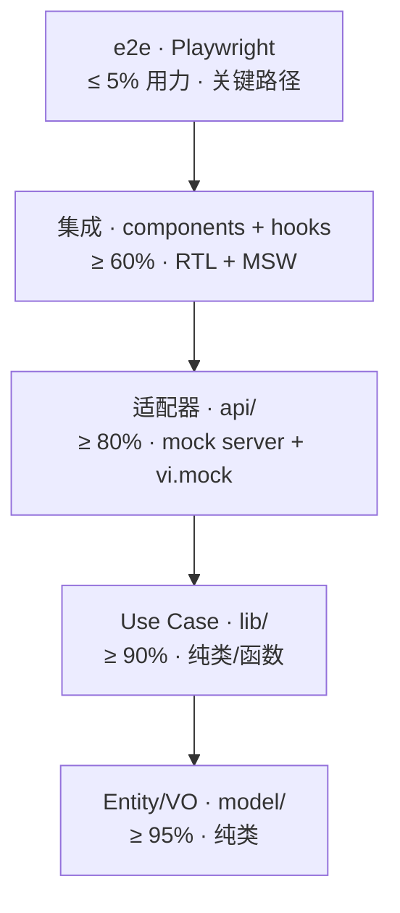

# 10 · 测试与 CI（FSD × DDD × Hex 三层测试金字塔 · import-linter · GitHub Actions）

> 测试覆盖按 FSD 切片层 × DDD 职责 × Hex 角色三维度分梯度：
> - **model/**（DDD 核心 / Hex core）≥ 95%，毫秒级纯单测
> - **lib/use-cases**（DDD 应用 / Hex application）≥ 90%
> - **api/adapters**（Hex 适配器）≥ 80%
> - **ui/**（FSD widgets BC 内部）≥ 70%
> - **pages/widgets/app**（装配壳）≥ 60%
>
> **CI 核心约束**：FSD 单向依赖 + bundle 检查（mock 不进生产）；与后端 enterprise-agent-os CI 平行。

> **基于 docs/web-refactor/09-测试与CI.md 模板**。
> 与原模板差异：与后端 enterprise-agent-os CI 平行；后端用 import-linter；前端用 ESLint + scripts/check-fsd-imports.sh；与后端 `docs/enterprise-agent-os/10-测试与CI.md` 平行阅读。

---

## 10.1 测试金字塔（FSD × DDD × Hex）



| 层 | FSD 落点 | DDD 视角 | Hex 视角 | 覆盖目标 | 速度 |
|---|---|---|---|---|---|
| **E2E** | `e2e/*.spec.ts` | 业务流 | 系统集成 | 关键路径 ≤ 5 用力 | 慢 |
| **组件集成** | `features/<bc>/ui/components/*.test.tsx` | UI 适配 | inbound adapter | ≥ 60% | 中 |
| **适配器** | `features/<bc>/api/adapters/*.test.ts` | 适配器 | Hex adapter | ≥ 80% | 中 |
| **Use Case** | `features/<bc>/lib/use-cases/*.test.ts` | 应用层 | Hex application | ≥ 90% | 毫秒 |
| **Entity/VO** | `features/<bc>/model/**/*.test.ts` | 领域核心 | Hex core | ≥ 95% | 毫秒 |
| **shared/utils** | `packages/utils/**/*.test.ts` | 通用工具 | Hex core 基础 | ≥ 95% | 毫秒 |

---

## 10.2 单元测试：model 层（DDD 核心 · Hex core）

### 10.2.1 Entity 单测（充血）

```ts
// features/session/model/entities/Session.test.ts
import { Session } from './Session';
import { SessionId } from '../value-objects/SessionId';
import { Turn } from './Turn';

describe('Session', () => {
  it('adds a new turn when idle', () => {
    const session = new Session(new SessionId('ses_001'), 'agv_001', 'ws_001');
    session.appendTurn(new Turn(1, 'hi', 'user'));
    expect(session.turns).toHaveLength(1);
    expect(session.status).toBe('running');
  });

  it('throws when closed', () => {
    const session = new Session(new SessionId('ses_001'), 'agv_001', 'ws_001');
    session.close();
    expect(() => session.appendTurn(new Turn(2, 'hi', 'user'))).toThrow('is closed');
  });

  it('appends chunks to a turn', () => {
    const session = new Session(new SessionId('ses_001'), 'agv_001', 'ws_001');
    const turn = new Turn(1, 'hi', 'user');
    session.appendTurn(turn);
    session.appendChunk(1, { type: 'message', delta: ' world' });
    expect(session.turns[0].content).toBe('hi world');
  });

  it('fromDTO reconstructs closed session', () => {
    const dto: SessionDTO = {
      id: 'ses_001',
      agent_version_id: 'agv_001',
      workspace_id: 'ws_001',
      status: 'closed',
      created_at: '2026-09-19T00:00:00Z',
      closed_at: '2026-09-19T01:00:00Z',
      turns: [],
      metadata: {},
    };
    const session = Session.fromDTO(dto);
    expect(session.status).toBe('closed');
  });
});
```

### 10.2.2 VO 单测

```ts
// features/session/model/value-objects/SessionId.test.ts
import { SessionId } from './SessionId';

describe('SessionId', () => {
  it('accepts valid ID', () => {
    expect(() => new SessionId('ses_001')).not.toThrow();
  });

  it('rejects empty', () => {
    expect(() => new SessionId('')).toThrow('must match ses_');
  });

  it('rejects invalid prefix', () => {
    expect(() => new SessionId('xyz_001')).toThrow('must match ses_');
  });
});
```

### 10.2.3 ACL 单测（关键）

```ts
// features/session/model/acl/agent_runtime.test.ts
import { mapAgentVersionToSessionCreateInput } from './agent_runtime';

describe('mapAgentVersionToSessionCreateInput', () => {
  it('maps a published AgentVersion', () => {
    const av: AgentVersionSummaryDTO = {
      id: 'agv_001',
      status: 'published',
      model: 'gpt-4',
      defaultTemperature: 0.5,
    };
    const input = mapAgentVersionToSessionCreateInput(av, 'ws_001');
    expect(input).toEqual({
      agentVersionId: 'agv_001',
      workspaceId: 'ws_001',
      model: 'gpt-4',
      temperature: 0.5,
    });
  });

  it('throws when AgentVersion is not published', () => {
    const av: AgentVersionSummaryDTO = {
      id: 'agv_001',
      status: 'draft',
      model: 'gpt-4',
    };
    expect(() => mapAgentVersionToSessionCreateInput(av, 'ws_001'))
      .toThrow('not published');
  });

  it('falls back to default temperature', () => {
    const av: AgentVersionSummaryDTO = {
      id: 'agv_001',
      status: 'published',
      model: 'gpt-4',
    };
    const input = mapAgentVersionToSessionCreateInput(av, 'ws_001');
    expect(input.temperature).toBe(0.7);
  });
});
```

---

## 10.3 单元测试：lib 层（DDD 应用 · Hex application）

### 10.3.1 Use Case 单测（MockApiAdapter 注入）

```ts
// features/session/lib/use-cases/SendTurnUseCase.test.ts
import { SendTurnUseCase } from './SendTurnUseCase';
import { MockApiSessionAdapter } from '../../api/adapters/MockApiAdapter';
import { InMemorySessionEventPublisher } from '../../api/events/SessionEventPublisher';
import { SessionId } from '../../model/value-objects/SessionId';

describe('SendTurnUseCase', () => {
  it('executes sendTurn and publishes events', async () => {
    const sessionRepo = new MockApiSessionAdapter();
    const eventBus = new InMemorySessionEventPublisher();
    const streamPort = new MockApiSessionAdapter();
    const useCase = new SendTurnUseCase({ sessionRepo, streamPort, eventBus });

    const chunks: unknown[] = [];
    for await (const chunk of useCase.execute(new SessionId('ses_001'), 'hi')) {
      chunks.push(chunk);
    }

    expect(chunks.length).toBeGreaterThan(0);

    await new Promise(r => setTimeout(r, 0));  // 等待 fire-and-forget
    expect((eventBus as any).published).toContainEqual(
      expect.objectContaining({ type: 'session.turn.completed' }),
    );
  });
});
```

### 10.3.2 业务 hook 测试

```ts
// features/session/lib/hooks/useSendTurn.test.ts
import { renderHook, act, waitFor } from '@testing-library/react';
import { QueryClient, QueryClientProvider } from '@tanstack/react-query';
import { useSendTurn } from './useSendTurn';
import { DepsContext } from '@/app/composition/DepsContext';
import { MockApiSessionAdapter } from '../../api/adapters/MockApiAdapter';
import { InMemorySessionEventPublisher } from '../../api/events/SessionEventPublisher';

function setup() {
  const qc = new QueryClient({ defaultOptions: { queries: { retry: false } } });
  const deps = {
    session: {
      sessionRepo: new MockApiSessionAdapter(),
      streamPort: new MockApiSessionAdapter(),
      eventBus: new InMemorySessionEventPublisher(),
    },
    // ... 其他 BC
  };
  const wrapper = ({ children }) => (
    <QueryClientProvider client={qc}>
      <DepsContext.Provider value={deps}>{children}</DepsContext.Provider>
    </QueryClientProvider>
  );
  return { wrapper, qc };
}

describe('useSendTurn', () => {
  it('mutates session', async () => {
    const { wrapper } = setup();
    const { result } = renderHook(() => useSendTurn(), { wrapper });
    await act(async () => {
      await result.current.mutateAsync({ sessionId: 'ses_001', content: 'hi' });
    });
    await waitFor(() => expect(result.current.isSuccess).toBe(true));
  });
});
```

---

## 10.4 集成测试：api 层（Hex 适配器）

### 10.4.1 HttpApiAdapter 集成测试（mock server）

```ts
// features/session/api/adapters/HttpApiSessionAdapter.test.ts
import { Server } from 'miragejs';
import { sessionHandlers } from '@eos/web-mock';

describe('HttpApiSessionAdapter', () => {
  let server: Server;

  beforeEach(() => {
    server = new Server({ environment: 'test', routes: sessionHandlers.routes() });
  });
  afterEach(() => server.shutdown());

  it('findById returns Entity', async () => {
    const adapter = new HttpApiSessionAdapter({ baseUrl: server.url });
    const session = await adapter.findById(new SessionId('ses_001'));
    expect(session).not.toBeNull();
  });

  it('streams turn chunks', async () => {
    const adapter = new HttpApiSessionAdapter({ baseUrl: server.url });
    const chunks: unknown[] = [];
    for await (const chunk of adapter.stream(new SessionId('ses_001'), { content: 'hi', traceId: 'tr_001' })) {
      chunks.push(chunk);
    }
    expect(chunks.length).toBeGreaterThan(0);
  });
});
```

### 10.4.2 MockApiAdapter 单测

```ts
// features/session/api/adapters/MockApiSessionAdapter.test.ts
describe('MockApiSessionAdapter', () => {
  it('findById returns Entity', async () => {
    const adapter = new MockApiSessionAdapter();
    const session = await adapter.findById(new SessionId('ses_001'));
    expect(session).not.toBeNull();
  });

  it('stream yields chunks', async () => {
    const adapter = new MockApiSessionAdapter();
    const chunks: unknown[] = [];
    for await (const chunk of adapter.stream(new SessionId('ses_001'), { content: 'hi', traceId: 'tr_001' })) {
      chunks.push(chunk);
    }
    expect(chunks.length).toBeGreaterThan(0);
  });
});
```

### 10.4.3 LocalStorageAdapter 单测

```ts
// features/session/api/adapters/LocalStorageSessionAdapter.test.ts
describe('LocalStorageSessionAdapter', () => {
  beforeEach(() => localStorage.clear());

  it('persists across instances', async () => {
    const a = new LocalStorageSessionAdapter();
    const session = await a.findById(new SessionId('ses_001'));
    session!.appendTurn(new Turn(1, 'hi', 'user'));
    await a.save(session!);

    const b = new LocalStorageSessionAdapter();
    const reloaded = await b.findById(new SessionId('ses_001'));
    expect(reloaded!.turns).toHaveLength(1);
  });
});
```

---

## 10.5 组件测试：ui 层（FSD widgets BC 内部）

### 10.5.1 L3 组件测试（接 Entity）

```tsx
// features/session/ui/components/CopilotPanel.test.tsx
import { render, screen, fireEvent } from '@testing-library/react';
import { CopilotPanel } from './CopilotPanel';
import { Session } from '../../model/entities/Session';
import { SessionId } from '../../model/value-objects/SessionId';
import { Turn } from '../../model/entities/Turn';

describe('CopilotPanel', () => {
  it('renders session turns', () => {
    const session = new Session(new SessionId('ses_001'), 'agv_001', 'ws_001');
    session.appendTurn(new Turn(1, 'hi', 'user'));
    render(
      <CopilotPanel
        session={session}
        streaming={false}
        chunks={[]}
        onSend={() => {}}
      />,
    );
    expect(screen.getByText('hi')).toBeInTheDocument();
  });

  it('renders streaming chunks', () => {
    const chunks: TurnChunkDTO[] = [
      { type: 'message', delta: 'Hello' },
      { type: 'tool_call', id: 'tc_001', tool_name: 'search', args: {} },
    ];
    render(
      <CopilotPanel
        session={null}
        streaming={true}
        chunks={chunks}
        onSend={() => {}}
      />,
    );
    expect(screen.getByText('Hello')).toBeInTheDocument();
    expect(screen.getByText(/search/)).toBeInTheDocument();
  });
});
```

### 10.5.2 L2 组件测试（跨 BC）

```tsx
// web/src/widgets/global-search/GlobalSearch.test.tsx
import { render, screen } from '@testing-library/react';

vi.mock('@/features/session/lib/hooks/useListSessions', () => ({
  useListSessions: () => ({ data: [{ id: 'ses_001', title: '销售周报' }] }),
}));
vi.mock('@/features/agent_runtime/lib/hooks/useListAgents', () => ({
  useListAgents: () => ({ data: [{ id: 'agt_001', name: '销售 Bot' }] }),
}));

describe('GlobalSearch', () => {
  it('renders hits from multiple BCs', async () => {
    render(<GlobalSearch onSelect={() => {}} />);
    expect(await screen.findByText(/销售周报/)).toBeInTheDocument();
    expect(await screen.findByText(/销售 Bot/)).toBeInTheDocument();
  });
});
```

---

## 10.6 集成测试：pages 与 router

### 10.6.1 Page 测试（MemoryRouter + DepsProvider）

```tsx
// features/session/ui/pages/SessionPage.test.tsx
import { render, screen } from '@testing-library/react';
import { MemoryRouter, Routes, Route } from 'react-router-dom';
import { QueryClient, QueryClientProvider } from '@tanstack/react-query';
import { DepsContext } from '@/app/composition/DepsContext';
import { SessionPage } from './SessionPage';
import { MockApiSessionAdapter } from '../../api/adapters/MockApiAdapter';

describe('SessionPage', () => {
  it('renders session', async () => {
    const qc = new QueryClient({ defaultOptions: { queries: { retry: false } } });
    const deps = { session: { sessionRepo: new MockApiSessionAdapter(), streamPort: new MockApiSessionAdapter(), eventBus: { publish: vi.fn() } } };

    render(
      <QueryClientProvider client={qc}>
        <DepsContext.Provider value={deps}>
          <MemoryRouter initialEntries={['/sessions/ses_001']}>
            <Routes>
              <Route path="/sessions/:id" element={<SessionPage />} />
            </Routes>
          </MemoryRouter>
        </DepsContext.Provider>
      </QueryClientProvider>,
    );

    expect(await screen.findByText(/Composer/)).toBeInTheDocument();
  });
});
```

### 10.6.2 路由跳转测试

```tsx
// web/src/app/router/index.test.tsx
import { render, screen } from '@testing-library/react';
import { RouterProvider, createMemoryRouter } from 'react-router-dom';
import { router } from './index';

describe('router', () => {
  it('/copilot redirects to /login when not authenticated', () => {
    useAuthStore.setState({ token: null });
    const memoryRouter = createMemoryRouter(router.routes, { initialEntries: ['/sessions/ses_001'] });
    render(<RouterProvider router={memoryRouter} />);
    expect(screen.getByText(/登录/)).toBeInTheDocument();
  });
});
```

---

## 10.7 覆盖率门禁（vitest）

```ts
// vitest.config.ts
import { defineConfig } from 'vitest/config';

export default defineConfig({
  test: {
    coverage: {
      provider: 'v8',
      reporter: ['text', 'html', 'json'],
      thresholds: {
        'features/*/model/**': { lines: 95, functions: 95, branches: 90, statements: 95 },
        'features/*/lib/**': { lines: 90, functions: 90, branches: 85, statements: 90 },
        'features/*/api/**': { lines: 80, functions: 80, branches: 75, statements: 80 },
        'features/*/ui/**': { lines: 70, functions: 70, branches: 65, statements: 70 },
        'web/src/pages/**': { lines: 60, functions: 60, branches: 55, statements: 60 },
        'packages/utils/**': { lines: 95, functions: 95, branches: 90, statements: 95 },
        'packages/ui/**': { lines: 85, functions: 85, branches: 80, statements: 85 },
        'packages/mock/**': { lines: 80, functions: 80, branches: 75, statements: 80 },
      },
      exclude: [
        'node_modules/',
        'dist/',
        '**/*.test.ts',
        '**/*.test.tsx',
        '**/index.ts',
        'web/src/dev/**',
      ],
    },
  },
});
```

---

## 10.8 ESLint FSD 单向依赖守门

```jsonc
// web/.eslintrc.json
{
  "extends": ["@feature-sliced/eslint-config"],
  "rules": {
    "import/no-internal-modules": [
      "error",
      {
        "allow": ["@eos/web-api", "@eos/web-mock", "@eos/web-utils", "@eos/web-ui", "@eos/web-hooks", "@eos/web-types"]
      }
    ],
    "no-restricted-imports": [
      "error",
      {
        "patterns": [
          {
            "group": ["@/features/*/model", "@/features/*/model/*"],
            "message": "FSD 单向依赖：仅同 BC 的 lib/ui 可 import model；widget 不可 import 其他 BC 的 model"
          },
          {
            "group": ["@/features/*/lib"],
            "message": "FSD 单向依赖：features/lib 仅同 BC 内部与 ui 互用；widget 不可 import 其他 BC 的 lib"
          },
          {
            "group": ["@/pages", "@/pages/*"],
            "message": "pages 不可被 features 引用"
          },
          {
            "group": ["@/app", "@/app/*"],
            "message": "app 不可被 features 引用"
          },
          {
            "group": ["@/widgets", "@/widgets/*"],
            "message": "widgets 仅 features/ui 暴露；features 不可 import widgets"
          },
          {
            "group": ["@eos/web-mock", "@eos/web-mock/*"],
            "message": "业务代码禁止直接 import @eos/web-mock；mock 由 features/<bc>/api/adapters/MockApiAdapter 注入"
          }
        ]
      }
    ]
  },
  "overrides": [
    {
      "files": ["features/*/lib/use-cases/*.ts", "features/*/lib/hooks/*.ts", "features/*/api/adapters/*.ts", "src/app/composition/**", "src/dev/**"],
      "rules": { "no-restricted-imports": "off" }
    },
    {
      "files": ["web/src/pages/*.tsx"],
      "rules": {
        "no-restricted-imports": [
          "error",
          {
            "patterns": [
              { "group": ["@/features/*/model", "@/features/*/lib"], "message": "FSD pages 不可依赖 model/lib；只引用 features/<bc>/ui 或 barrel" }
            ]
          }
        ]
      }
    }
  ]
}
```

---

## 10.9 import-linter 二次守门

```bash
# web/scripts/check-fsd-imports.sh
#!/usr/bin/env bash
set -e
ERRORS=0

# 1. pages 不能 import model/lib
if grep -rEn "from ['\"]@/features/[a-z]+/(model|lib)" src/pages/; then
  echo "❌ FSD violation: src/pages/* imports features/<bc>/{model,lib}"
  ERRORS=1
fi

# 2. features 不能 import widgets/pages/app
if grep -rEn "from ['\"]@/(widgets|pages|app)" src/features/; then
  echo "❌ FSD violation: features/* imports @/widgets or @/pages or @/app"
  ERRORS=1
fi

# 3. features 不能 import 其他 BC 的 model/lib
for bc in agent_runtime session skill tool knowledge memory governance identity channel; do
  OTHER_BC_DIRS=$(ls src/features/ | grep -v "^$bc$" | tr '\n' '|')
  if grep -rEn "from ['\"]@/features/(${OTHER_BC_DIRS%|})/(model|lib)" src/features/$bc/ 2>/dev/null; then
    echo "❌ FSD violation: features/$bc/ imports other BC's model/lib"
    ERRORS=1
  fi
done

# 4. 业务代码禁止 import @eos/web-mock
if grep -rEn "from ['\"]@eos/web-mock" src/features/ src/widgets/ src/pages/; then
  echo "❌ Hex violation: business code imports @eos/web-mock"
  ERRORS=1
fi

# 5. model 不应 import react / zustand / react-query
if grep -rEn "(from ['\"]react|from ['\"]zustand|from ['\"]@tanstack/react-query)" src/features/*/model/; then
  echo "❌ Hex violation: model/ imports react/zustand/react-query"
  ERRORS=1
fi

exit $ERRORS
```

```jsonc
// web/package.json
{
  "scripts": {
    "lint": "eslint .",
    "lint:fsd": "bash scripts/check-fsd-imports.sh",
    "ci:guard": "pnpm typecheck && pnpm lint && pnpm lint:fsd"
  }
}
```

---

## 10.10 GitHub Actions CI

### 10.10.1 主流程

```yaml
# .github/workflows/web-test.yml
name: Web Test

on: [pull_request, push]

jobs:
  test:
    runs-on: ubuntu-latest
    steps:
      - uses: actions/checkout@v4
      - uses: pnpm/action-setup@v3
        with: { version: 9 }
      - uses: actions/setup-node@v4
        with: { node-version: 20, cache: pnpm }
      - run: pnpm install --frozen-lockfile
      - run: pnpm typecheck
      - run: pnpm lint
      - run: pnpm lint:fsd
      - run: pnpm test --run
      - run: pnpm test:coverage --run
      - name: Upload coverage
        uses: codecov/codecov-action@v4

  build:
    needs: test
    runs-on: ubuntu-latest
    steps:
      - uses: actions/checkout@v4
      - uses: pnpm/action-setup@v3
        with: { version: 9 }
      - uses: actions/setup-node@v4
        with: { node-version: 20, cache: pnpm }
      - run: pnpm install --frozen-lockfile
      - run: pnpm build
      - name: Bundle check
        run: |
          ! grep -r "dispatchMockRequest" dist/ || (echo "mock leaked" && exit 1)
          ! grep -r "@eos/web-mock" dist/ || (echo "mock pkg leaked" && exit 1)
          ! grep -r "MockApiSessionAdapter" dist/ || (echo "MockApiAdapter leaked" && exit 1)
          ! grep -r "LocalStorageSessionAdapter" dist/ || (echo "LocalStorageAdapter leaked" && exit 1)
          ! grep -r "installMockBridge" dist/ || (echo "mock-bridge leaked" && exit 1)
          ! grep -r "isMockToken" dist/ || (echo "mock token leaked" && exit 1)
          ! grep -r "MockTokenPicker" dist/ || (echo "mock picker leaked" && exit 1)

  e2e:
    needs: build
    runs-on: ubuntu-latest
    if: github.ref == 'refs/heads/main' || github.event_name == 'pull_request'
    steps:
      - uses: actions/checkout@v4
      - uses: pnpm/action-setup@v3
        with: { version: 9 }
      - uses: actions/setup-node@v4
        with: { node-version: 20, cache: pnpm }
      - run: pnpm install --frozen-lockfile
      - run: npx playwright install --with-deps
      - run: pnpm e2e
      - uses: actions/upload-artifact@v4
        if: failure()
        with: { name: playwright-report, path: playwright-report/ }
```

### 10.10.2 PR 检查矩阵

| 检查 | 命令 | 失败则 |
|---|---|---|
| TypeScript | `pnpm typecheck` | 阻断合并 |
| ESLint | `pnpm lint` | 阻断合并 |
| FSD 单向依赖 | `pnpm lint:fsd` | 阻断合并 |
| 单测 + 集成 | `pnpm test --run` | 阻断合并 |
| 覆盖率门禁 | `pnpm test:coverage --run` | 阻断合并 |
| 生产构建 | `pnpm build` | 阻断合并 |
| bundle 检查 | `! grep ...` | 阻断合并 |
| E2E | `pnpm e2e` | 阻断合并 |

---

## 10.11 契约测试（与后端对齐）

```ts
// tests/contract/session.contract.test.ts
import { api } from '@eos/web-api';
import { mock } from '@eos/web-mock';

describe('session contract: api vs mock', () => {
  it('getSession shape aligned', async () => {
    const fromApi = api.session.getSession as any;
    const fromMock = await mock.session.getSession('ses_001');
    expect(Object.keys(fromMock)).toEqual(
      expect.arrayContaining(['id', 'agent_version_id', 'workspace_id', 'status', 'turns']),
    );
  });
});
```

> **关键**：mock 与 api 共享 `@eos/web-types` 类型契约；契约测试保证形态一致。

---

## 10.12 E2E（Playwright · 关键路径）

```ts
// e2e/login.spec.ts
import { test, expect } from '@playwright/test';

test('login with mock token', async ({ page }) => {
  await page.goto('/login');
  await page.fill('input[name=token]', 'mock-tenant-acme');
  await page.click('button[type=submit]');
  await expect(page).toHaveURL(/\/$/);
});

test('select workspace', async ({ page }) => {
  // ...
});

test('create and send turn', async ({ page }) => {
  await page.goto('/sessions');
  await page.click('button:has-text("新建会话")');
  await page.fill('textarea', 'hi');
  await page.click('button:has-text("发送")');
  await expect(page.locator('[data-testid=turn-narrative]')).toContainText(/hi|思考/);
});
```

```yaml
# playwright.config.ts
projects:
  - name: chromium
    use: { baseURL: 'http://localhost:5173' }
```

---

## 10.13 测试性能与并行

```jsonc
// vitest.config.ts
{
  "test": {
    "projects": [
      { "test": { "name": "unit:model", "include": ["features/**/model/**/*.test.ts"] } },
      { "test": { "name": "unit:lib", "include": ["features/**/lib/**/*.test.ts"] } },
      { "test": { "name": "integration:api", "include": ["features/**/api/**/*.test.ts"] } },
      { "test": { "name": "component:ui", "include": ["features/**/ui/**/*.test.tsx"] } }
    ]
  }
}
```

| 阶段 | 目标时长 |
|---|---|
| model 单测 | < 30s |
| lib 单测 | < 30s |
| api 集成 | < 60s |
| ui 组件 | < 60s |
| 完整 PR | < 5min |

---

## 10.14 CI 与构建守门（汇总）

| 检查 | 命令 | 阻断合并 |
|---|---|---|
| TypeScript | `pnpm typecheck` | ✅ |
| ESLint | `pnpm lint` | ✅ |
| FSD 单向依赖 | `pnpm lint:fsd` | ✅ |
| 单测 + 集成 | `pnpm test --run` | ✅ |
| 覆盖率门禁 | `pnpm test:coverage --run` | ✅ |
| 生产构建 | `pnpm build` | ✅ |
| Bundle 检查 | mock 关键字 grep | ✅ |
| E2E | `pnpm e2e` | ✅ |
| 视觉回归 | `chromatic` | 远期 |

---

## 10.15 与后端 CI 平行

| 后端 CI | 前端 CI |
|---|---|
| `backend-test.yml`（pytest） | `web-test.yml`（vitest） |
| `import-linter` | `lint:fsd` |
| `alembic upgrade` | 无（前端无数据库） |
| `bandit / safety` | `npm audit` |
| `docker build` | `pnpm build` + bundle check |
| `e2e-smoke.yml` | `e2e`（Playwright） |

> **核心**：前后端 CI **平行但独立**；共享 `.github/workflows/`；触发时机对齐。

---

## 10.16 不在本节范围

- 性能基准（lighthouse · 见 [11-部署与运行](11-部署与运行.md)）
- 安全审计（npm audit · CI 内置）
- 混沌测试（远期）
- 视觉回归（Chromatic · 远期 P5）