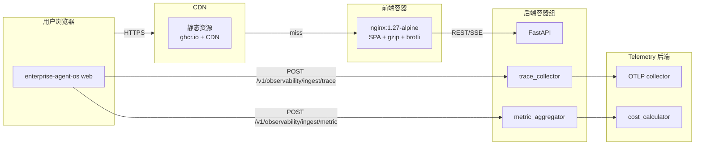

# 11 · 部署与运行（Vite · docker-compose · 环境变量 · 性能目标 · Observability 部署）

> 前端 4D 架构部署与运行手册，与后端 `docs/enterprise-agent-os/11-部署与运行.md` 平行：
> - **构建工具**：Vite 5（生产）+ Turbopack（开发备用）
> - **运行时**：浏览器（静态资源）+ Node（SSR/中间层可选）
> - **镜像**：multi-stage Dockerfile → nginx:1.27-alpine
> - **编排**：docker-compose（前端 + 后端 API 平行部署）
> - **CI/CD**：GitHub Actions → GHCR → staging/production
> - **可观测性**：前端 reporter 上报到后端 collector

> **基于 docs/web-refactor/11-部署与运行.md 模板**。
> 与原模板差异：使用 `@eos/*` 路径别名；增加 OpenAPI Codegen pipeline；与后端部署平行；observability 数据上报到后端 collector；与后端 `docs/enterprise-agent-os/11-部署与运行.md` 平行阅读。

---

## 11.1 部署拓扑



| 资产 | 部署位置 | 来源 |
|---|---|---|
| `index.html` + hashed JS/CSS | CDN / Nginx | Vite build |
| `@eos/web-types` 生成的 `.d.ts` | 编译期打入 bundle | `pnpm codegen` |
| 静态 mock fixture（dev only） | 不进生产 bundle | `import.meta.env.DEV` |
| OpenAPI YAML | 后端仓库 | `backend/openapi.yaml` |

---

## 11.2 本地开发环境

### 11.2.1 前置依赖

| 工具 | 版本 | 用途 |
|---|---|---|
| Node.js | 20 LTS | 运行时 |
| pnpm | 9 | workspace 管理 |
| Docker | 24+ | 本地后端+observability |
| 后端 `openapi.yaml` | latest | Codegen 类型源 |

### 11.2.2 启动步骤

```bash
# 1. 安装依赖
git clone git@github.com:your-org/digital-employee-platform.git
cd digital-employee-platform/enterprise-agent-os/web
pnpm install

# 2. 启动后端（mock 或真实）
docker compose -f docker-compose.dev.yml up -d backend

# 3. 生成 DTO 类型
pnpm codegen

# 4. 启动前端 dev server
pnpm dev
# → http://localhost:5173

# 5. 启用 mock 模式
# → 访问 /login，输入 `mock-tenant-acme` 进入 mock 全流程
```

### 11.2.3 docker-compose.dev.yml（前端 + 后端 + observability）

```yaml
version: '3.9'

services:
  web:
    image: node:20-alpine
    working_dir: /app
    command: pnpm dev
    ports: ['5173:5173']
    volumes: ['./:/app']
    environment:
      VITE_API_BASE_URL: http://localhost:8000
      VITE_WS_BASE_URL: ws://localhost:8000
      VITE_OTLP_ENDPOINT: http://localhost:4318
      VITE_SENTRY_DSN: ''
    depends_on: [backend]

  backend:
    build: ../../backend
    ports: ['8000:8000']
    environment:
      DATABASE_URL: postgresql://postgres:postgres@db:5432/agentos
      OTLP_ENDPOINT: http://otel:4318
    depends_on: [db, otel]

  db:
    image: postgres:16-alpine
    environment: { POSTGRES_DB: agentos, POSTGRES_PASSWORD: postgres }
    ports: ['5432:5432']

  otel:
    image: otel/opentelemetry-collector:0.100.0
    command: ['--config=/etc/otel/config.yaml']
    volumes: ['./otel.dev.yaml:/etc/otel/config.yaml:ro']
    ports: ['4317:4317', '4318:4318']
```

---

## 11.3 环境变量

### 11.3.1 前端构建期变量（Vite）

```bash
# .env.development
VITE_API_BASE_URL=http://localhost:8000
VITE_WS_BASE_URL=ws://localhost:8000
VITE_OTLP_ENDPOINT=http://localhost:4318
VITE_SENTRY_DSN=
VITE_APP_VERSION=1.0.0-dev
VITE_DEFAULT_MODE=http
VITE_FEATURE_MOCK_BRIDGE=true

# .env.staging
VITE_API_BASE_URL=https://api.staging.eos.example.com
VITE_WS_BASE_URL=wss://api.staging.eos.example.com
VITE_OTLP_ENDPOINT=https://otel.staging.eos.example.com
VITE_SENTRY_DSN=https://xxx@sentry.io/1
VITE_APP_VERSION=1.0.0-staging
VITE_DEFAULT_MODE=http
VITE_FEATURE_MOCK_BRIDGE=true

# .env.production
VITE_API_BASE_URL=https://api.eos.example.com
VITE_WS_BASE_URL=wss://api.eos.example.com
VITE_OTLP_ENDPOINT=https://otel.eos.example.com
VITE_SENTRY_DSN=https://xxx@sentry.io/2
VITE_APP_VERSION=1.0.0
VITE_DEFAULT_MODE=http
VITE_FEATURE_MOCK_BRIDGE=false
```

### 11.3.2 运行时变量

| 变量 | 说明 | 默认 | 来源 |
|---|---|---|---|
| `VITE_API_BASE_URL` | API 基础 URL | `http://localhost:8000` | 构建期 |
| `VITE_WS_BASE_URL` | WebSocket 基础 URL | 同上 | 构建期 |
| `VITE_OTLP_ENDPOINT` | OTLP collector | `http://localhost:4318` | 构建期 |
| `VITE_SENTRY_DSN` | Sentry DSN（可选） | 空 | 构建期 |
| `VITE_APP_VERSION` | 客户端版本 | `1.0.0-dev` | 构建期 |
| `VITE_DEFAULT_MODE` | 适配器模式 | `http` | 构建期 |
| `VITE_FEATURE_MOCK_BRIDGE` | 是否启用 mock-bridge | `false` (prod) | 构建期 |

### 11.3.3 运行时动态配置（DepProvider）

```ts
// web/src/app/composition/adapters.ts
export function buildDeps(mode: AdapterMode = (import.meta.env.VITE_DEFAULT_MODE as AdapterMode) ?? 'http') {
  // ... 装配逻辑
}
```

```ts
// web/src/app/composition/resolveMode.ts
export function resolveMode(token: string | null, env: ImportMetaEnv): AdapterMode {
  if (!navigator.onLine) return 'local';
  if (token?.startsWith('mock-')) return 'mock';
  if (env.VITE_DEFAULT_MODE === 'mock') return 'mock';
  return 'http';
}
```

---

## 11.4 生产构建

### 11.4.1 构建命令

```bash
# 完整构建流程
pnpm install --frozen-lockfile
pnpm codegen
pnpm typecheck
pnpm lint
pnpm lint:fsd
pnpm test --run
pnpm test:coverage --run
pnpm build
```

### 11.4.2 Vite 配置

```ts
// vite.config.ts
import { defineConfig } from 'vite';
import react from '@vitejs/plugin-react';
import tsconfigPaths from 'vite-tsconfig-paths';
import { VitePWA } from 'vite-plugin-pwa';

export default defineConfig({
  plugins: [
    react(),
    tsconfigPaths(),
    VitePWA({
      registerType: 'autoUpdate',
      includeAssets: ['favicon.svg', 'robots.txt'],
      manifest: {
        name: 'Enterprise Agent OS',
        short_name: 'EOS',
        theme_color: '#1677ff',
        icons: [{ src: '/icon-192.png', sizes: '192x192', type: 'image/png' }],
      },
    }),
  ],
  resolve: {
    alias: {
      '@eos/web-api': '/packages/api/src/index.ts',
      '@eos/web-mock': '/packages/mock/src/index.ts',
      '@eos/web-types': '/packages/types/src/index.ts',
      '@eos/web-hooks': '/packages/hooks/src/index.ts',
      '@eos/web-ui': '/packages/ui/src/index.ts',
      '@eos/web-utils': '/packages/utils/src/index.ts',
      '@': '/web/src',
    },
  },
  build: {
    target: 'es2020',
    sourcemap: true,
    cssCodeSplit: true,
    rollupOptions: {
      output: {
        manualChunks: {
          'react-vendor': ['react', 'react-dom', 'react-router-dom'],
          'query-vendor': ['@tanstack/react-query', '@tanstack/react-router'],
          'ui-vendor': ['antd', '@ant-design/icons'],
          'editor-vendor': ['@monaco-editor/react', 'monaco-editor'],
        },
      },
    },
  },
  server: {
    port: 5173,
    proxy: {
      '/api': 'http://localhost:8000',
      '/v1': 'http://localhost:8000',
    },
  },
});
```

### 11.4.3 产物结构

```
web/dist/
├── index.html
├── manifest.webmanifest
├── sw.js                          # Service Worker（PWA）
├── icon-192.png
├── icon-512.png
├── assets/
│   ├── index-abc123.js            # 主入口（含 route bundle）
│   ├── CopilotPanel-def456.js
│   ├── react-vendor-789.js        # manualChunks
│   ├── ui-vendor-012.js
│   └── index-ghi345.css
└── chunks/
    ├── monaco-345.js              # 按需加载
    └── ...
```

### 11.4.4 Bundle 大小预算

| chunk | 预算 | 实测（CI 检查） |
|---|---|---|
| `index-*.js`（含 router） | ≤ 500 KB gzipped | 失败阻断 |
| `react-vendor-*.js` | ≤ 200 KB gzipped | 失败阻断 |
| `ui-vendor-*.js`（antd） | ≤ 400 KB gzipped | 失败阻断 |
| `query-vendor-*.js` | ≤ 100 KB gzipped | 失败阻断 |
| `editor-vendor-*.js` | ≤ 1.5 MB gzipped（按需） | warn |
| 总 bundle | ≤ 2 MB gzipped | 失败阻断 |
| **mock 检查** | 无 `dispatchMockRequest` / `MockApi*` / `LocalStorage*Adapter` / `installMockBridge` / `isMockToken` | 失败阻断 |

```bash
# CI 强制检查（web-test.yml）
! grep -r "dispatchMockRequest\|MockApiSessionAdapter\|LocalStorageSessionAdapter\|installMockBridge\|isMockToken" dist/ \
  || (echo "mock leaked to production" && exit 1)
```

---

## 11.5 Docker 镜像

### 11.5.1 Dockerfile（multi-stage）

```dockerfile
# Stage 1: deps
FROM node:20-alpine AS deps
WORKDIR /app
COPY package.json pnpm-workspace.yaml pnpm-lock.yaml ./
COPY web/package.json ./web/
COPY web/packages/*/package.json ./web/packages/
RUN corepack enable && pnpm install --frozen-lockfile

# Stage 2: build
FROM node:20-alpine AS build
WORKDIR /app
COPY --from=deps /app /app
COPY web ./web
WORKDIR /app/web
RUN corepack enable && pnpm codegen && pnpm build

# Stage 3: runtime (nginx)
FROM nginx:1.27-alpine AS runtime
COPY --from=build /app/web/dist /usr/share/nginx/html
COPY web/nginx.conf /etc/nginx/conf.d/default.conf
EXPOSE 80
HEALTHCHECK --interval=30s --timeout=5s --retries=3 \
  CMD wget --quiet --tries=1 --spider http://localhost/ || exit 1
```

### 11.5.2 nginx.conf

```nginx
server {
    listen 80;
    server_name _;
    root /usr/share/nginx/html;
    index index.html;

    # gzip + brotli
    gzip on;
    gzip_types text/plain text/css application/json application/javascript text/xml application/xml;
    gzip_min_length 1024;
    brotli on;
    brotli_types text/plain text/css application/json application/javascript text/xml application/xml;

    # SPA fallback
    location / {
        try_files $uri $uri/ /index.html;
    }

    # Cache static assets (1 year)
    location ~* \.(js|css|png|jpg|svg|woff2)$ {
        expires 1y;
        add_header Cache-Control "public, immutable";
    }

    # index.html: no-cache
    location = /index.html {
        add_header Cache-Control "no-cache, no-store, must-revalidate";
    }

    # sw.js: must not be cached (PWA)
    location = /sw.js {
        add_header Cache-Control "no-cache, no-store, must-revalidate";
    }

    # Security headers
    add_header X-Content-Type-Options nosniff always;
    add_header X-Frame-Options DENY always;
    add_header Referrer-Policy "strict-origin-when-cross-origin" always;
    add_header Content-Security-Policy "default-src 'self'; script-src 'self' 'unsafe-inline'; style-src 'self' 'unsafe-inline'; img-src 'self' data: blob: https:; connect-src 'self' https://api.eos.example.com https://otel.eos.example.com https://*.sentry.io wss://api.eos.example.com" always;

    # Health check
    location = /healthz {
        return 200 'ok';
        add_header Content-Type text/plain;
    }
}
```

### 11.5.3 镜像大小预算

| 镜像 | 预算 |
|---|---|
| 最终镜像 | ≤ 30 MB |
| 多阶段构建 cache | 利用率 ≥ 80% |

---

## 11.6 容器编排

### 11.6.1 docker-compose.yml（staging / production 平行）

```yaml
version: '3.9'

services:
  web:
    image: ghcr.io/your-org/eos-web:${TAG:-latest}
    ports: ['80:80']
    restart: unless-stopped
    environment:
      VITE_API_BASE_URL: ${API_BASE_URL}
      VITE_OTLP_ENDPOINT: ${OTLP_ENDPOINT}
      VITE_SENTRY_DSN: ${SENTRY_DSN}
      VITE_APP_VERSION: ${TAG:-latest}
    healthcheck:
      test: ['CMD', 'wget', '--spider', '-q', 'http://localhost/healthz']
      interval: 30s
      timeout: 5s
      retries: 3
    deploy:
      replicas: 3
      resources:
        limits: { cpus: '0.5', memory: 256M }
    depends_on: [backend]

  backend:
    image: ghcr.io/your-org/eos-backend:${TAG:-latest}
    ports: ['8000:8000']
    restart: unless-stopped
    environment:
      DATABASE_URL: ${DATABASE_URL}
      OTLP_ENDPOINT: ${OTLP_ENDPOINT}
    deploy:
      replicas: 4
      resources: { limits: { cpus: '1.0', memory: 1G } }

  otel-collector:
    image: otel/opentelemetry-collector:0.100.0
    command: ['--config=/etc/otel/config.yaml']
    volumes: ['./otel.yaml:/etc/otel/config.yaml:ro']
    ports: ['4317:4317', '4318:4318']

  prometheus:
    image: prom/prometheus:v2.51.0
    volumes: ['./prometheus.yml:/etc/prometheus/prometheus.yml:ro']
    ports: ['9090:9090']
```

### 11.6.2 Kubernetes（生产）

```yaml
# k8s/web-deployment.yaml
apiVersion: apps/v1
kind: Deployment
metadata: { name: eos-web, namespace: eos }
spec:
  replicas: 3
  selector: { matchLabels: { app: eos-web } }
  template:
    metadata: { labels: { app: eos-web } }
    spec:
      containers:
        - name: web
          image: ghcr.io/your-org/eos-web:${TAG}
          ports: [{ containerPort: 80 }]
          env:
            - { name: VITE_API_BASE_URL, valueFrom: { configMapKeyRef: { name: eos-config, key: apiBaseUrl } } }
            - { name: VITE_OTLP_ENDPOINT, valueFrom: { configMapKeyRef: { name: eos-config, key: otlpEndpoint } } }
            - { name: VITE_APP_VERSION, valueFrom: { fieldRef: { fieldPath: metadata.labels['app.kubernetes.io/version'] } } }
          resources:
            requests: { cpu: 100m, memory: 128Mi }
            limits: { cpu: 500m, memory: 256Mi }
          livenessProbe: { httpGet: { path: /healthz, port: 80 }, initialDelaySeconds: 5, periodSeconds: 30 }
          readinessProbe: { httpGet: { path: /healthz, port: 80 }, initialDelaySeconds: 2, periodSeconds: 10 }
---
apiVersion: v1
kind: Service
metadata: { name: eos-web }
spec:
  type: ClusterIP
  selector: { app: eos-web }
  ports: [{ port: 80, targetPort: 80 }]
```

---

## 11.7 CDN 与缓存策略

| 资源类型 | Cache-Control | CDN 缓存 |
|---|---|---|
| `index.html` | `no-cache, no-store, must-revalidate` | 不缓存 |
| `sw.js` | `no-cache, no-store, must-revalidate` | 不缓存 |
| hashed `assets/*.js` | `public, max-age=31536000, immutable` | 1 年 |
| hashed `assets/*.css` | `public, max-age=31536000, immutable` | 1 年 |
| `icon-*.png` `favicon.svg` | `public, max-age=31536000, immutable` | 1 年 |
| `manifest.webmanifest` | `public, max-age=86400` | 1 天 |

### 11.7.1 版本回滚

- 新版本发布 → CDN 立即拉取新 `index.html`
- 用户访问 → 加载新 `index.html`（含新 hash）→ 拉取新 assets
- 旧 hash assets 仍可被已加载用户使用
- 回滚：发布旧 tag → CDN 拉取旧 `index.html` → 强制刷新

---

## 11.8 CI/CD 流水线

### 11.8.1 构建与推送

```yaml
# .github/workflows/web-build.yml
name: Web Build & Push

on:
  push:
    branches: [main]
    paths: ['enterprise-agent-os/web/**', '.github/workflows/web-build.yml']
    tags: ['v*']

jobs:
  build:
    runs-on: ubuntu-latest
    permissions: { contents: read, packages: write }
    steps:
      - uses: actions/checkout@v4
      - uses: pnpm/action-setup@v3
        with: { version: 9 }
      - uses: actions/setup-node@v4
        with: { node-version: 20, cache: pnpm }
      - run: pnpm install --frozen-lockfile
      - name: Fetch backend openapi.yaml
        run: |
          git fetch origin main --depth=1
          cp ../backend/openapi.yaml web/openapi.yaml || echo "no openapi"
      - run: pnpm codegen
      - run: pnpm typecheck
      - run: pnpm lint && pnpm lint:fsd
      - run: pnpm test --run
      - run: pnpm test:coverage --run
      - run: pnpm build
      - name: Bundle size check
        run: |
          ! grep -r "dispatchMockRequest\|MockApi\|LocalStorage.*Adapter\|installMockBridge\|isMockToken" web/dist/ \
            || (echo "mock leaked" && exit 1)
      - name: Build & push Docker image
        uses: docker/build-push-action@v5
        with:
          context: .
          file: enterprise-agent-os/web/Dockerfile
          push: true
          tags: |
            ghcr.io/your-org/eos-web:${{ github.sha }}
            ghcr.io/your-org/eos-web:${{ github.ref_name }}
          cache-from: type=gha
          cache-to: type=gha,mode=max

  deploy-staging:
    needs: build
    if: github.ref == 'refs/heads/main'
    runs-on: ubuntu-latest
    environment: staging
    steps:
      - uses: appleboy/ssh-action@v1
        with:
          host: ${{ secrets.STAGING_HOST }}
          username: ${{ secrets.STAGING_USER }}
          script: |
            cd /opt/eos
            TAG=${{ github.sha }} docker compose pull web
            TAG=${{ github.sha }} docker compose up -d web
            sleep 30
            curl -fsS http://localhost/healthz
```

### 11.8.2 部署清单

| 环境 | 触发 | 部署目标 |
|---|---|---|
| **preview** | PR | ephemeral 容器 |
| **staging** | push main | staging 集群 |
| **production** | tag v* | 生产 K8s 蓝绿 |
| **rollback** | 手动 | 切回上一 tag |

---

## 11.9 性能目标

### 11.9.1 Web Vitals（lighthouse CI）

| 指标 | 目标 | 测量 |
|---|---|---|
| **LCP**（Largest Contentful Paint） | ≤ 2.5s | staging |
| **FID**（First Input Delay） | ≤ 100ms | staging |
| **CLS**（Cumulative Layout Shift） | ≤ 0.1 | staging |
| **TTFB**（Time to First Byte） | ≤ 600ms | staging |
| **TTI**（Time to Interactive） | ≤ 3.5s | staging |
| **TBT**（Total Blocking Time） | ≤ 300ms | staging |

### 11.9.2 Bundle 大小

| chunk | gzipped 预算 |
|---|---|
| main bundle | ≤ 500 KB |
| react-vendor | ≤ 200 KB |
| ui-vendor | ≤ 400 KB |
| query-vendor | ≤ 100 KB |
| 总 bundle | ≤ 2 MB |

### 11.9.3 运行时性能

| 指标 | 目标 |
|---|---|
| 首屏渲染（SSR 关闭） | ≤ 1.5s（4G） |
| SSE 首个 chunk | ≤ 200ms |
| 路由切换 | ≤ 100ms |
| List 渲染 100 行 | ≤ 16ms（1 frame） |
| Long Task | 0（CI 检查） |

### 11.9.4 lighthouse CI

```yaml
# .github/workflows/lighthouse.yml
name: Lighthouse
on: [pull_request]
jobs:
  lighthouse:
    runs-on: ubuntu-latest
    steps:
      - uses: actions/checkout@v4
      - uses: treosh/lighthouse-ci-action@v10
        with:
          urls: |
            http://localhost:5173/
            http://localhost:5173/login
            http://localhost:5173/sessions/ses_001
          uploadArtifacts: true
```

---

## 11.10 可观测性部署

### 11.10.1 前端 Reporter 上报到后端 Collector

```ts
// web/src/observability/trace/Reporter.ts
export class ObservabilityReporter {
  async reportTrace(span: Span): Promise<void> {
    if (import.meta.env.PROD) {
      await fetch(`${import.meta.env.VITE_API_BASE_URL}/v1/observability/ingest/trace`, {
        method: 'POST',
        headers: {
          'Content-Type': 'application/json',
          'Authorization': `Bearer ${getToken()}`,
        },
        body: JSON.stringify(span),
      });
    }
  }
}
```

### 11.10.2 OTLP 直连（可选）

```ts
// OTLP/HTTP for browser
import { OTLPTraceExporter } from '@opentelemetry/exporter-trace-otlp-http';

const exporter = new OTLPTraceExporter({
  url: `${import.meta.env.VITE_OTLP_ENDPOINT}/v1/traces`,
});
```

### 11.10.3 Sentry 集成（生产）

```ts
// web/src/app/index.tsx
import * as Sentry from '@sentry/react';

if (import.meta.env.PROD && import.meta.env.VITE_SENTRY_DSN) {
  Sentry.init({
    dsn: import.meta.env.VITE_SENTRY_DSN,
    environment: 'production',
    release: `eos-web@${import.meta.env.VITE_APP_VERSION}`,
    tracesSampleRate: 0.1,
    beforeSend(event) {
      if (event.user) {
        delete event.user.ip_address;
        event.user.id = hashUserId(event.user.id);
      }
      return event;
    },
  });
}
```

### 11.10.4 RUM（Real User Monitoring）

```ts
// web/src/observability/rum/index.ts
export function initRUM(): void {
  // 监听 PerformanceObserver
  const observer = new PerformanceObserver((list) => {
    for (const entry of list.getEntries()) {
      metricReporter.record({
        name: `browser.${entry.entryType}`,
        value: entry.duration ?? entry.startTime,
        timestamp: Date.now(),
      });
    }
  });
  observer.observe({ type: 'navigation', buffered: true });
  observer.observe({ type: 'largest-contentful-paint', buffered: true });
  observer.observe({ type: 'first-input', buffered: true });
  observer.observe({ type: 'layout-shift', buffered: true });
  observer.observe({ type: 'longtask', buffered: true });
}
```

---

## 11.11 健康检查与就绪探针

| 端点 | 检查 |
|---|---|
| `GET /healthz` | nginx 返回 200 |
| `GET /sw.js` | Service Worker 可访问 |
| `GET /manifest.webmanifest` | PWA manifest 可访问 |
| `GET /icon-192.png` | 图标可访问 |

```bash
# 部署后验证
curl -fsS http://localhost/healthz
curl -fsSI http://localhost/manifest.webmanifest | head -1
curl -fsSI http://localhost/icon-192.png | head -1
```

---

## 11.12 运行时排错

### 11.12.1 常见故障

| 症状 | 原因 | 排查 |
|---|---|---|
| 加载白屏 | `index.html` 404 | 检查 SPA fallback |
| 404 API | proxy/反向代理 | 检查 `VITE_API_BASE_URL` |
| SSE 卡死 | 反向代理超时 | 设 `proxy_read_timeout 3600s` |
| mock 数据泄漏 | `VITE_FEATURE_MOCK_BRIDGE=true` | 生产改为 `false` |
| trace 漏报 | OTLP 端点不通 | 检查 `VITE_OTLP_ENDPOINT` |

### 11.12.2 调试入口

```bash
# 浏览器调试
localStorage.setItem('eos:debug', 'true');
localStorage.setItem('eos:adapter-mode', 'mock');  // 临时切 mock
localStorage.setItem('eos:trace-id', 'tr_debug_001');

# 查看 trace
console.log(window.__EOS_TRACE__.get());

# 查看 mock fixtures
console.log(await import('@eos/web-mock'));
```

### 11.12.3 日志

- 浏览器：`console.*` → 仅在 dev
- 浏览器：上报到 Sentry（生产）
- 浏览器：上报到 OTLP（生产）
- 服务端：nginx access/error → stdout → 收集器

---

## 11.13 灰度与蓝绿

### 11.13.1 灰度发布

```yaml
# K8s Ingress
apiVersion: networking.k8s.io/v1
kind: Ingress
metadata:
  name: eos-web
  annotations:
    nginx.ingress.kubernetes.io/canary: "true"
    nginx.ingress.kubernetes.io/canary-weight: "10"
spec:
  rules:
    - host: eos.example.com
      http:
        paths:
          - backend: { service: { name: eos-web-canary, port: { number: 80 } } }
```

### 11.13.2 蓝绿切换

```bash
# 切流量
kubectl patch service eos-web -p '{"spec":{"selector":{"version":"green"}}}'

# 回滚
kubectl patch service eos-web -p '{"spec":{"selector":{"version":"blue"}}}'
```

---

## 11.14 PWA 与离线

```ts
// vite.config.ts（已在 11.4.2）
VitePWA({
  registerType: 'autoUpdate',
  workbox: {
    runtimeCaching: [
      {
        urlPattern: /^https:\/\/api\.eos\.example\.com\/v1\/sessions\/.*\/turns$/,
        handler: 'NetworkOnly',  // SSE 不可缓存
      },
      {
        urlPattern: /^https:\/\/api\.eos\.example\.com\/v1\/(agents|sessions|tools|skills|knowledge|memory|governance|identity)$/,
        handler: 'NetworkFirst',
        options: { cacheName: 'api-cache', expiration: { maxAgeSeconds: 60 * 5 } },
      },
    ],
  },
})
```

---

## 11.15 与后端部署平行

| 后端部署 | 前端部署 |
|---|---|
| `docker-compose.backend.yml` | `docker-compose.web.yml` |
| K8s `backend-deployment.yaml` | K8s `web-deployment.yaml` |
| 后端 healthz `/healthz` | 前端 healthz `/healthz`（nginx） |
| 后端 OTLP 4317/4318 | 前端 OTLP `/v1/observability/ingest/*` |
| 后端 sentry SDK | 前端 sentry SDK |
| 后端 CI `backend-test.yml` | 前端 CI `web-test.yml` |
| 后端 staging K8s | 前端 staging K8s（同 cluster） |
| 后端 rollup blue-green | 前端 CDN 版本切换 |

---

## 11.16 不在本节范围

- 后端部署细节 → 见后端 `docs/enterprise-agent-os/11-部署与运行.md`
- K8s 集群运维 → 平台文档
- CDN 厂商配置 → 平台文档
- 监控告警规则 → [09-可观测性](09-可观测性.md) + 平台文档